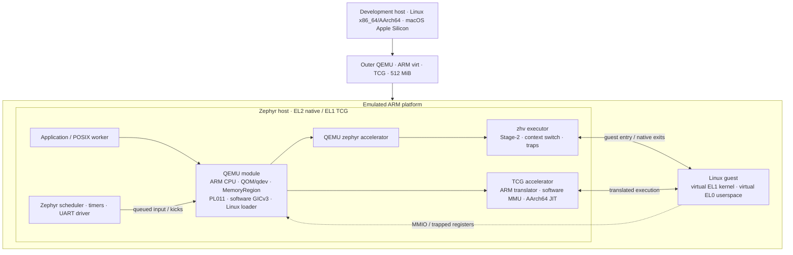

<div align="center">

# QEMU on Zephyr

### QEMU's device models. Zephyr's runtime. Linux as the guest.

[](https://github.com/processmission/qemu-on-zephyr/actions/workflows/build.yml)


An out-of-tree Zephyr module hosting QEMU's ARM machine and device models,
running ARM64 Linux through native EL2 virtualization or TCG translation.

[Quick start](#quick-start) · [Architecture](#architecture) · [Development](CONTRIBUTING.md) · [中文](README.zh-CN.md)

</div>

---

| **Real QEMU models** | **Two execution backends** | **Repeatable workspace** |
| :--- | :--- | :--- |
| ARM CPU, QOM/qdev, MemoryRegion, PL011, software GICv3 and the original Linux loader. | Choose the native `zephyr` accelerator or upstream TCG with an AArch64 JIT. Neither requires host KVM. | Pinned upstream sources, local patches, automatic SDK/Python setup, and a Linux boot acceptance test. |

## Quick start

**Use Linux x86_64/AArch64 or macOS Apple Silicon, with Python 3.12+.**
Ubuntu 24.04 is the reference Linux setup. On macOS, install Xcode Command
Line Tools and Homebrew first; see [host requirements](docs/setup.md#host-requirements).
No ARM board or host KVM is required: the development host runs an outer
QEMU instance using TCG.

```sh
git clone https://github.com/processmission/qemu-on-zephyr.git
cd qemu-on-zephyr

# Install host packages (Linux package manager or Homebrew on macOS).
bash scripts/install-host-deps.sh

# Set up local tools, upstream sources, SDK and verified guest assets.
make setup

# Build and enter the Linux guest shell.
make run
```

**No venv activation or manual SDK export is needed for Make.**
Choose a backend and guest CPU at build time:

```sh
make run ACCEL=zephyr CPU=cortex-a57   # Native EL2; matching outer CPU
make run ACCEL=tcg CPU=cortex-a72      # TCG on an EL1 Cortex-A53 host
make check ACCEL=tcg CPU=cortex-a53    # Automated Linux acceptance
```

Supported models are `cortex-a53`, `cortex-a57` and `cortex-a72`. The default
remains `ACCEL=zephyr CPU=cortex-a53`. See [backend profiles](docs/backends.md).

Use **Ctrl-a, then x** to exit outer QEMU. Guest `poweroff -f` leaves the Zephyr
host running.

<details>
<summary><strong>What does <code>make setup</code> install?</strong></summary>

1. Creates `.venv/` with pinned west, CMake and Ninja versions.
2. Creates a **repository-local** west workspace and runs `west update` for
   QEMU, Zephyr, dtc/libfdt and zlib. No unrelated HALs or firmware are fetched.
3. Uses `west packages` to install the module's Python build/test requirements.
4. Applies local patches and source overlays to disposable build trees.
5. Reuses **Zephyr SDK 1.0.1**, or invokes `west sdk install` for the
   **AArch64 GNU toolchain and host tools**, including QEMU.
6. Downloads the Linux Image and initramfs and verifies their SHA256 hashes.

SDK selection is saved locally. Downloaded SDKs live in `.tools/`; an already
registered SDK can be reused. Setup never invokes sudo or installs Python
packages globally. It can be rerun after an interrupted setup.

</details>

<details>
<summary><strong>Already have an SDK, or prefer native west commands?</strong></summary>

```sh
ZEPHYR_SDK_INSTALL_DIR=/path/to/zephyr-sdk-1.0.1 make setup

# Optional: open a shell configured for native west commands.
. .tools/env.sh
west list
west update
make prepare
west build -b qemu_cortex_a53 -d build/linux apps/qemu_linux
make run
```

`west/west.yml` is the source revision manifest. Upstream checkouts also remain
Git submodules, so Git records their exact versions. See [setup details](docs/setup.md)
for initialization, offline use and troubleshooting.

</details>

## See it run

The serial console identifies the host and the inner QEMU machine:

```text
QEMU Linux host EL2
QEMU machine=zephyr-virt-machine cpu=cortex-a53-arm-cpu accel=zephyr-accel (Zephyr) RAM=256MiB
...
Run /bin/sh as init process
~ # uname -m
aarch64
```

`make check` drives that shell and checks working serial input, timer IRQ growth,
native EL0/MMU execution, host scheduling while the guest is busy, and host
survival after guest poweroff.

## Architecture



**There are two QEMUs.** The outer executable emulates the development hardware
and loads `zephyr.elf`. The inner QEMU is compiled into that ELF: it creates
the guest machine and loads Linux. Native execution uses `zephyr-accel` and
`zhv`; software execution uses upstream TCG translation and its software MMU.
The TCG profile boots the Zephyr host at EL1 with outer virtualization disabled.
The outer platform is TCG-emulated in either profile.

| Layer | Responsibility | Start reading |
| :--- | :--- | :--- |
| Application | QEMU worker and independent host heartbeat | [`apps/qemu_linux/`](apps/qemu_linux/) |
| Machine and adapters | Devices, Linux loading, GLib, files, console, event loop | [`src/qemu/ports/zephyr/`](src/qemu/ports/zephyr/) |
| Accelerator | vCPU lifecycle, clocks, wait/kick and native execution | [`src/qemu/accel/zephyr/`](src/qemu/accel/zephyr/) |
| TCG host adapter | Serial execution, wakeups and separate RW/RX code aliases | [`src/qemu/ports/zephyr/tcg.c`](src/qemu/ports/zephyr/tcg.c) |
| ARM adapter | CPU state, MMIO, system-register and PSCI exits | [`src/qemu/target/arm/zephyr.c`](src/qemu/target/arm/zephyr.c) |
| EL2 executor | Stage-2, guest entry/exit, TLS/FP state and timer delivery | [`src/zephyr/arch/arm64/core/hypervisor/`](src/zephyr/arch/arm64/core/hypervisor/) |

The module uses **Zephyr's CMake/Ninja build**, not QEMU's Meson build. It
compiles an explicit subset of upstream QEMU and retains QEMU's QAPI/trace
generators. Native QEMU and Stage-2 share guest RAM; TCG uses its software MMU over a
separate reserved RAM buffer. Both use the original QEMU device models.

> **Module boundary:** QEMU integration is out of tree, but the EL2 host also
> needs the Zephyr architecture patches included here. Native execution requires the prepared Zephyr tree. TCG does not need
> EL2, but the managed workspace still applies the common patch series.

More: [implementation map](docs/architecture.md) · [executor API](src/zephyr/include/zephyr/virtualization/zhv.h).

## Workspace layout

```text
qemu-on-zephyr/
├── west/west.yml          # Fixed upstream revisions; no full manifest import
├── upstream/             # Clean QEMU, Zephyr, dtc and zlib Git submodules
├── patches/              # Atomic patches with explicit series ordering
├── src/{qemu,zephyr}/     # New implementation files and architecture tests
├── zephyr/               # Module metadata, Kconfig and CMake source list
├── apps/                 # Linux guest and standalone PL011 examples
├── scripts/              # Setup, preparation, build and run commands
├── tests/                # Environment, GLib and filesystem tests
└── docs/                 # Setup, architecture, assets and validation
```

Generated `.venv/`, `.west/`, `.tools/`, `downloads/` and `build/` stay outside
Git. Builds export the pinned sources, apply `patches/`, overlay `src/`, and
compile under `build/sources/`. Upstream repositories remain clean. Edit the
versioned source or patches, **not** the generated trees.

## Everyday commands

| Command | Purpose |
| :--- | :--- |
| `make setup` / `make doctor` | Configure dependencies / diagnose the environment |
| `make update` | Synchronize pinned upstream repositories with west |
| `make build` / `make run` | Build the ELF / boot into the guest shell |
| `make check` | End-to-end Linux acceptance; stops QEMU afterward |
| `make probe` / `make native-probe` | Device models / native accelerator diagnostics |
| `make test-payload` / `make test-glib` | Filesystem / GLib compatibility regressions |
| `make test-arch` / `make test-tools` | Architecture, FPU, executor / setup regressions |
| `make clean` | Remove generated builds; retain tools, SDK and guest downloads |

Use `JOBS=16` to adjust parallel builds. `QEMU_SYSTEM_AARCH64` overrides the
SDK-hosted QEMU. Run `make help` for the command list.

## Status and scope

**Working profile:** one VM, one Cortex-A53/A57/A72 vCPU, 256 MiB guest RAM, PL011,
software GICv3, Linux 6.4.16 and an initramfs shell.

- Linux console, timer IRQs, EL0/MMU execution and concurrent host scheduling
  are covered by the acceptance test.
- Component coverage includes 196 filesystem checks, 184 GLib differential
  output lines and 26 architecture/FPU/executor test cases.
- SDK-provided QEMU 10.0.2 and system QEMU 10.2.2 have booted the profile.

Physical ARM boards, multiple VMs/vCPUs, block/network backends, migration,
guest EL2/EL3 and VM restart/hotplug are outside the implemented or validated
profile. This is an **experimental integration**, not a production isolation
boundary. See [validation evidence and limits](docs/validation.md) and the
[patch series](docs/patches.md).

## Contributing and licenses

Start with [CONTRIBUTING.md](CONTRIBUTING.md). Keep upstream adaptations in
patches and new code in source overlays; include the relevant test results.

Components retain their original licenses, including GPL-2.0-or-later and
Apache-2.0. Guest binaries are downloaded test inputs and are not committed.
See [license and provenance details](LICENSE.md) and [guest asset sources](docs/guest-assets.md).
