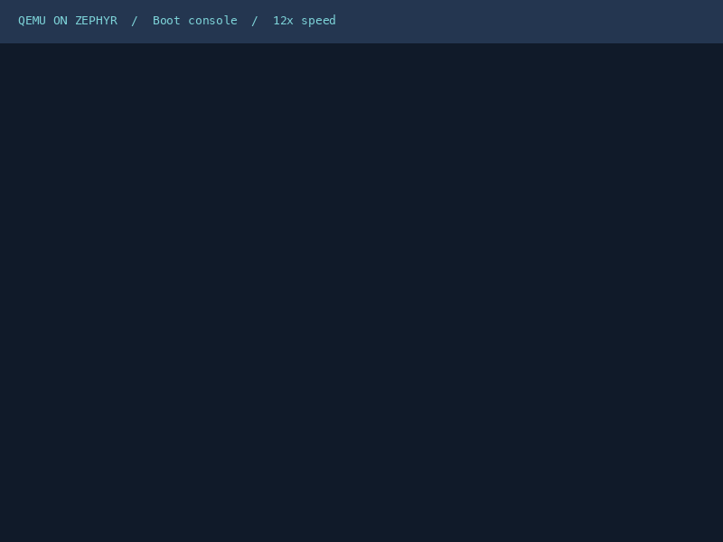
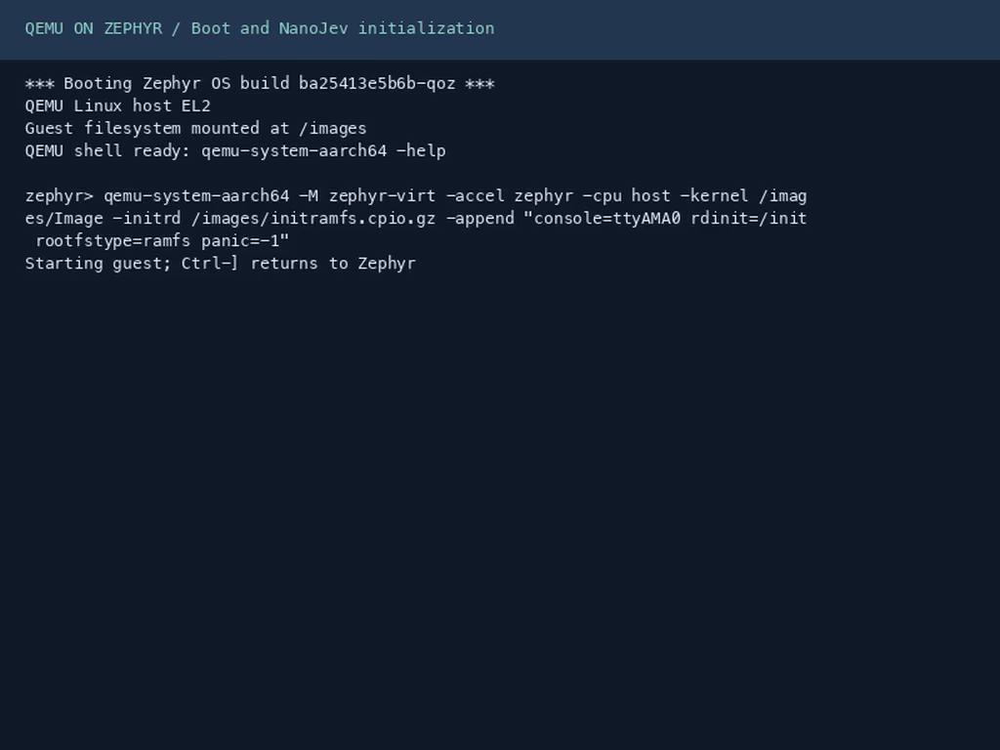

<h1 align="center">QEMU on Zephyr</h1>

<p align="center">
  <strong>Run ARM64 Linux inside Zephyr.</strong><br>
  Linux desktops · Firmware · Static Linux programs
</p>

<p align="center">
  <a href="https://github.com/processmission/qemu-on-zephyr/actions/workflows/build.yml"></a>
  <a href="docs/backends.md"></a>
  <a href="docs/setup.md"></a>
  <a href="docs/validation.md"></a>
</p>

<p align="center">
  <strong>English</strong> · <a href="README.zh-CN.md">简体中文</a>
</p>

<p align="center">
  <a href="#in-action">Demos</a> ·
  <a href="#quick-start">Quick start</a> ·
  <a href="#validation">Validation</a> ·
  <a href="#documentation">Documentation</a>
</p>

---

System mode runs Linux kernels and firmware with the `zephyr` EL2 accelerator
or QEMU TCG. User mode uses TCG and translates Linux syscalls to Zephyr operations.

> **Experimental AArch64 integration.** Validated on an outer QEMU `virt`
> platform. Physical boards and production isolation remain unvalidated.

## In action

### Alpine Linux desktop

Alpine Linux, Xorg and JWM inside Zephyr, using the `zephyr` EL2 accelerator
and 256 MiB guest RAM. The recording shows terminal commands, the desktop
menu and window dragging.

<p align="center">
  <a href="docs/images/system-desktop.gif"></a><br>
  <sub>800 × 600 display · Actual execution · Startup at 12× speed · Desktop at normal speed</sub>
</p>

<p align="center">
  <a href="#alpine-desktop">Run the desktop</a> ·
  <a href="docs/desktop.md#record-the-demonstrations">Reproduce the recording</a>
</p>

### Linux user programs

Run a static AArch64 Linux program with arguments and environment variables,
then return to the Zephyr shell for another execution.

<p align="center">
  <a href="docs/images/linux-user.gif"></a><br>
  <sub>AArch64 TCG · Actual UART output · Startup at 12× speed · Program execution at normal speed</sub>
</p>

### NanoJev CPU maze

NanoJev runs local CPU inference inside a Debian ARM64 desktop with ZHV.
The complete 8 × 8 recording reaches the goal in 19 attempts with 3 collisions,
using dynamic INT8 linear layers and FP32 embeddings and decision heads.

<p align="center">
  <a href="docs/images/nanojev-cpu.gif"></a><br>
  <sub>Outer HVF · Inner ZHV · Boot and initialization at 12× speed · Complete maze at normal speed</sub>
</p>

<p align="center">
  <a href="#nanojev-cpu-desktop">Run NanoJev</a> ·
  <a href="docs/images/nanojev-cpu.mp4">Watch the complete video</a>
</p>

## Quick start

Use Linux x86_64/AArch64 or macOS Apple Silicon with Python 3.12+.
macOS requires Xcode Command Line Tools and Homebrew.

```sh
git clone https://github.com/processmission/qemu-on-zephyr.git
cd qemu-on-zephyr
bash scripts/install-host-deps.sh
make setup
```

Setup prepares the pinned sources, Python tools, Zephyr SDK 1.0.1 and guest
assets. Then start a desktop, a Linux console or a Linux user program:

### Alpine desktop

Start a Docker daemon that can execute `linux/arm64` containers, then run:

```sh
make desktop
```

The QEMU window displays the desktop. Desktop control uses `xdotool` from the
Linux serial shell. [Desktop setup and controls](docs/desktop.md)

### Linux console

```sh
make run
```

Linux starts automatically. Use `make run QEMU_SHELL=1` to enter the Zephyr
shell and supply a launch command manually.

### NanoJev CPU desktop

Run NanoJev's local maze decisions in a separate Debian ARM64 desktop image,
using the ZHV EL2 accelerator and 3 GiB guest RAM:

```sh
make nanojev
```

This image requires Docker with Linux ARM64 support and at least 16 GiB host RAM.
[NanoJev image and desktop controls](docs/nanojev.md)

On Apple Silicon with nested virtualization support and a recent Homebrew QEMU:

```sh
make nanojev CPU=host HOST_ACCEL=hvf QEMU_SYSTEM_AARCH64="$(command -v qemu-system-aarch64)"
```

### Static Linux program

The default user disk contains an SDK-built static Linux ELF:

```sh
make run QEMU_MODE=user QEMU_ARGS='/images/hello arg1'
```

<details>
<summary>Launch user programs from the Zephyr shell</summary>

On the development host:

```sh
make run QEMU_MODE=user QEMU_SHELL=1
```

At `zephyr>`:

```text
qemu-aarch64 /images/hello arg1
```

</details>

## External programs

Use `GUEST_FILES` to place your compiled programs under `/images`.
Files are provided through a read-only disk snapshot; updated files take
effect after disk regeneration and an outer QEMU restart. The
[external-program workflow](docs/guidelines.md#external-programs-and-updates)
covers both managed and explicitly named disks.

## Run and exit

| Action | Result |
| --- | --- |
| <kbd>Ctrl</kbd> + <kbd>]</kbd> | Stop the current guest or program and return to Zephyr |
| `poweroff -f` in Linux | Shut down Linux and return to Zephyr |
| `kernel reboot cold` at `zephyr>` | Reboot Zephyr before launching another system VM |
| <kbd>Ctrl</kbd> + <kbd>a</kbd>, then <kbd>x</kbd> | Exit outer QEMU |

User programs can run successively in the same Zephyr boot.

## Validation

| Command | Verification |
| --- | --- |
| `make check` | Linux boot, console, timer interrupts and host scheduling |
| `make check-user` | Linux process execution, syscalls, memory and consecutive launches |
| `make check-desktop` | Alpine desktop startup, interaction, display frames and guest shutdown |
| `make check-nanojev` | NanoJev CPU inference and display interaction inside the ZHV Linux guest |

Desktop validation requires Docker and the dependencies in `requirements-demo.txt`.

## Documentation

| Resource | Contents |
| --- | --- |
| [Usage guidelines](docs/guidelines.md) · [中文指南](docs/guidelines.zh-CN.md) | Options, firmware, external programs and troubleshooting |
| [Environment setup](docs/setup.md) | Dependencies, SDK, proxies and offline setup |
| [Desktop and recordings](docs/desktop.md) | Alpine images, controls and GIF recording |
| [Architecture](docs/architecture.md) · [Backends](docs/backends.md) | QEMU integration, EL2 execution and TCG |
| [Linux user-mode interfaces](docs/user-mode.md) | Supported syscalls and process memory |
| [Technical paper](docs/paper.md) · [Validation](docs/validation.md) | Porting analysis and recorded execution evidence |
| [Contributing](CONTRIBUTING.md) | Source changes, patches and development checks |

Components retain their original licenses. See [license and source provenance](LICENSE.md).
