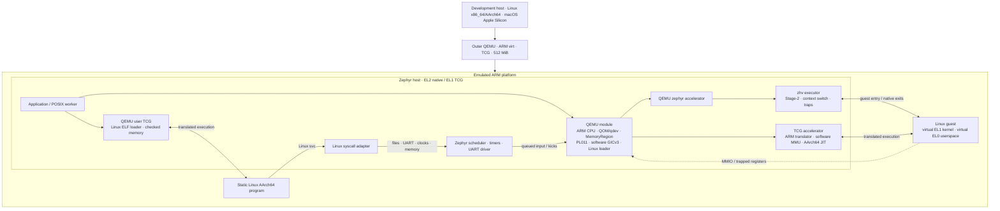

<div align="center">

# QEMU on Zephyr

### QEMU system and Linux user emulation on Zephyr.

[](https://github.com/processmission/qemu-on-zephyr/actions/workflows/build.yml)


An out-of-tree Zephyr module running ARM64 Linux and firmware through QEMU
system emulation, and static Linux AArch64 programs through QEMU user emulation.
Launch either from the Zephyr shell and load files from a mounted disk.

[Quick start](#quick-start) · [Launch modes](#launch-modes) · [Image files](#image-files) · [Linux user mode](#linux-user-mode) · [Architecture](#architecture) · [中文](README.zh-CN.md)

</div>

---

| **Real QEMU models** | **Two execution backends** | **Repeatable workspace** |
| :--- | :--- | :--- |
| ARM CPU, QOM/qdev, MemoryRegion, PL011, software GICv3 and Linux/ELF loaders. | System mode uses `zephyr` EL2 virtualization or TCG; user mode uses TCG and translates Linux syscalls to Zephyr. | Pinned upstream sources, SDK/Python setup, Ext2 image preparation, and system/user acceptance tests on Linux and macOS. |

## Quick start

**Use Linux x86_64/AArch64 or macOS Apple Silicon, with Python 3.12+.**
Ubuntu 24.04 is the reference Linux setup. On macOS, install Xcode Command
Line Tools and Homebrew first; see [host requirements](docs/setup.md#host-requirements).
No ARM board or host KVM is required: the development host runs an outer
QEMU instance using TCG.

```sh
git clone https://github.com/processmission/qemu-on-zephyr.git
cd qemu-on-zephyr

# Install host packages (Linux package manager or Homebrew on macOS).
bash scripts/install-host-deps.sh

# Set up local tools, upstream sources, SDK and verified guest assets.
make setup

# Build and enter the Zephyr shell.
make run QEMU_SHELL=1
```

At the `zephyr>` prompt, load Linux from the mounted filesystem:

```text
fs ls /images
qemu-system-aarch64 -M zephyr-virt -accel zephyr -cpu cortex-a53 -kernel /images/Image -initrd /images/initramfs.cpio.gz
```

Use Ctrl-] to stop the guest and return to Zephyr. After a guest finishes,
`kernel reboot cold` prepares another launch. See [shell and filesystem use](docs/shell.md)
for custom kernels, ELF firmware and raw `-bios` images.

`make run` starts Linux automatically. `QEMU_SHELL=1` waits for a manual
command. The [launch modes](#launch-modes), [image preparation](#image-files)
and [Linux user mode](#linux-user-mode) sections below cover the available
Make parameters and shell commands.

**No venv activation or manual SDK export is needed for Make.**
Select the inner QEMU machine, accelerator and guest CPU:

```sh
make run QEMU_ARGS='-M zephyr-virt -accel zephyr -cpu cortex-a57'
make run QEMU_ARGS='-M zephyr-virt,accel=tcg -cpu cortex-a72'
make check QEMU_ARGS='-accel tcg -cpu cortex-a53'
```

Supported CPU models are `cortex-a53`, `cortex-a57` and `cortex-a72`. The default
is `zephyr-virt` with `zephyr` and Cortex-A53. `ACCEL` and `CPU` provide defaults
for options omitted from `QEMU_ARGS`. The outer QEMU board is fixed to `virt`.
Use `make run QEMU_ARGS='-help'` or see [backend profiles](docs/backends.md).

Use **Ctrl-a, then x** to exit outer QEMU. Guest `poweroff -f` leaves the Zephyr
host running.

<details>
<summary><strong>What does <code>make setup</code> install?</strong></summary>

1. Creates `.venv/` with pinned west, CMake and Ninja versions.
2. Creates a **repository-local** west workspace and runs `west update` for
   QEMU, Zephyr, dtc/libfdt and zlib. No unrelated HALs or firmware are fetched.
3. Uses `west packages` to install the module's Python build/test requirements.
4. Applies local patches and source overlays to disposable build trees.
5. Reuses **Zephyr SDK 1.0.1**, or invokes `west sdk install` for the
   **AArch64 GNU toolchain and host tools**, including QEMU.
6. Downloads the Linux Image and initramfs and verifies their SHA256 hashes.

SDK selection is saved locally. Downloaded SDKs live in `.tools/`; an already
registered SDK can be reused. Setup never invokes sudo or installs Python
packages globally. It can be rerun after an interrupted setup.

</details>

<details>
<summary><strong>Already have an SDK, or prefer native west commands?</strong></summary>

```sh
ZEPHYR_SDK_INSTALL_DIR=/path/to/zephyr-sdk-1.0.1 make setup

# Optional: open a shell configured for native west commands.
. .tools/env.sh
west list
west update
make prepare
west build -b qemu_cortex_a53 -d build/linux apps/qemu_linux
make run
```

`west/west.yml` is the source revision manifest. Upstream checkouts also remain
Git submodules, so Git records their exact versions. See [setup details](docs/setup.md)
for initialization, offline use and troubleshooting.

</details>

## Launch modes

The outer QEMU always uses the `virt` board and TCG. The following Make
parameters configure QEMU inside Zephyr:

| Parameter | Meaning |
| :--- | :--- |
| `QEMU_MODE=system` | Default; build the `qemu-system-aarch64` shell command |
| `QEMU_MODE=user` | Build the `qemu-aarch64` shell command for Linux programs |
| `QEMU_SHELL=0` | Default; execute the configured command after boot and filesystem mounting |
| `QEMU_SHELL=1` | Enter the Zephyr shell and wait for a command |
| `QEMU_ARGS='…'` | System: `-M`/`-machine`, `-accel`, `-cpu`; user: `-cpu`, `-E`, `-strace`, program path and arguments |
| `ACCEL`, `CPU` | Defaults for omitted system options; `CPU` also selects the user CPU model |
| `GUEST_FILES=/absolute/path` | Host directory used to populate the image disk |
| `GUEST_DISK=/absolute/path/disk.img` | Existing disk to attach; also selects the output of `make guest-disk` |

System and user modes use separate firmware builds. Native system execution
runs Zephyr at EL2 with the `zephyr` accelerator; TCG system execution and
user emulation run Zephyr at EL1. The native backend uses ARM virtualization
inside the outer QEMU platform. Physical-board operation remains unvalidated.

Automatic system startup loads `/images/Image` and `/images/initramfs.cpio.gz`.
Use the system shell command for other image paths. Automatic user startup
requires a program path in `QEMU_ARGS`.

The system accelerator is selected at build time. Its shell `-accel` option
must match that build. Native `-cpu` must also match the configured host CPU;
a TCG system build accepts A53, A57 or A72 at the shell. User mode always uses
TCG, and its shell `-cpu` must match the compiled model. `QEMU_MODE` and
`QEMU_SHELL` selections use separate build directories.

## Image files

`make run` prepares `build/guest-disk.img` from the verified Linux downloads
by default. Outer QEMU provides a VirtIO Block disk; Zephyr mounts its Ext2
filesystem read-only at `/images`, containing `Image` and
`initramfs.cpio.gz`. `make host-deps` installs e2fsprogs on Linux or macOS,
and the build tools locate its `mke2fs` executable.

To use your own Linux images, firmware or user programs, place regular files
and subdirectories in a host directory. Create a disk and attach it:

```sh
make guest-disk GUEST_FILES=/absolute/path/to/images GUEST_DISK="$PWD/build/custom.img"
make run QEMU_SHELL=1 GUEST_DISK="$PWD/build/custom.img"
```

At the Zephyr prompt, `fs ls /images` lists its contents. A host file
`/absolute/path/to/images/firmware.elf` becomes `/images/firmware.elf`.
`GUEST_FILES` with `make run` also creates or updates the default disk;
an explicit `GUEST_DISK` on `make run` attaches that existing file. Use
`make guest-disk` to regenerate an explicitly named disk after changing its
source files. Keep the output disk outside `GUEST_FILES`; symbolic links
are rejected.

An existing disk must contain Ext2 at sector zero, with 4096-byte blocks,
128-byte inodes and the `filetype` feature. Zephyr disables automatic
formatting. Writes to `/images` return `EROFS`. Loaders can also use other
filesystems mounted by the application. See [filesystem details](docs/shell.md#preparing-image-files).

## System shell command

Start a manual TCG system session on the development host:

```sh
make run QEMU_MODE=system QEMU_SHELL=1 QEMU_ARGS='-M zephyr-virt -accel tcg -cpu cortex-a53'
```

Then load Linux at the `zephyr>` prompt:

```text
qemu-system-aarch64 -help
qemu-system-aarch64 -M zephyr-virt -accel tcg -cpu cortex-a72 -kernel /images/Image -initrd /images/initramfs.cpio.gz -append "console=ttyAMA0 rdinit=/bin/sh nokaslr panic=-1"
```

| Shell option | Meaning |
| :--- | :--- |
| `-M`, `-machine` | `zephyr-virt`, including `type=` and `accel=` properties |
| `-accel`, `-cpu` | Select the compiled accelerator and a supported CPU as described above |
| `-kernel PATH` | Linux AArch64 Image or AArch64 ELF firmware |
| `-initrd PATH`, `-append STRING` | Optional initramfs and quoted kernel command line |
| `-bios PATH` | Raw EL1 firmware loaded and entered at `0x40000000` |
| `-m 256M`, `-smp 1`, `-nographic` | Fixed guest memory, one vCPU and serial console |
| `-help` | Usage; `-M help`, `-accel help`, `-cpu help` list selections |
| `-status` | Guest state, completed execution counters and host scheduling counters on demand |

Use absolute Zephyr paths. Choose exactly one of `-kernel` or `-bios`;
`-initrd` and `-append` require `-kernel`. For a custom disk containing
firmware, either of these commands starts the corresponding image:

```text
qemu-system-aarch64 -kernel /images/firmware.elf
qemu-system-aarch64 -bios /images/firmware.bin
```

Run each firmware command in a fresh Zephyr boot. The machine provides RAM
at `0x40000000`, PL011 at `0x09000000` and a software GICv3. Raw firmware must
be linked for its load address. QEMU's ELF loader handles ELF segments and
the entry point.

### Guest exit and relaunch

System emulation is compiled into Zephyr and initializes one VM per Zephyr
boot. `QEMU guest exited: 0` means its execution loop ended successfully;
the machine, CPU and other global QEMU objects still exist. A second launch
therefore reports `QEMU already initialized; use kernel reboot cold before
another guest`.

Reboot at the Zephyr shell, wait for the new prompt, then launch again:

```text
kernel reboot cold
qemu-system-aarch64 -kernel /images/Image -initrd /images/initramfs.cpio.gz
```

Argument and missing-file errors allow an immediate retry. Loader failures
after QEMU initialization also require a Zephyr reboot. Linux `poweroff -f`
and Ctrl-] restore the Zephyr shell. Execution and host scheduling counters
are printed only when you enter `qemu-system-aarch64 -status`.

## Linux user mode

Place statically linked Linux AArch64 executables in a host directory and
select the separate user firmware:

```sh
make run QEMU_MODE=user QEMU_SHELL=1 GUEST_FILES=/absolute/path/to/programs
```

At the Zephyr prompt, load a program from the mounted filesystem:

```text
fs ls /images
qemu-aarch64 -help
qemu-aarch64 -cpu cortex-a53 -E MESSAGE=hello /images/hello "an argument"
qemu-aarch64 -strace /images/hello
```

The command accepts the compiled `-cpu` model, `-strace` for syscall tracing,
and up to eight `-E NAME=VALUE` settings. Arguments after the program path
belong to that program; quote arguments containing spaces. The default
working directory is `/images`.

For automatic execution, supply the program and arguments through Make:

```sh
make run QEMU_MODE=user QEMU_ARGS='-cpu cortex-a53 -E MESSAGE=hello /images/hello "an argument"' GUEST_FILES=/absolute/path/to/programs
```

User mode executes the program through upstream QEMU user TCG and its Linux
ELF loader. Linux `svc` instructions enter an adapter that translates syscall
arguments, flags, structures and error numbers to Zephyr operations:

- File and console operations include `read`/`write`, vectored I/O,
  `openat`, `close`, `lseek`, `fstat`, `newfstatat`, `getcwd` and `chdir`.
- Memory operations include `brk`, private `mmap`, `munmap` and `mprotect`.
  TCG checks guest memory access and invalidates translated code after writes.
- Time and entropy use Zephyr clocks, scheduling and VirtIO RNG. The outer
  host's `/dev/urandom` supplies `getrandom` and ELF `AT_RANDOM` data.
- Process interfaces provide per-launch IDs, a virtual root identity,
  `set_tid_address`, resource-limit queries, `uname`, `exit` and `exit_group`.

The supported profile is one **static, single-threaded command-line program**
at a time, with a 64 MiB address space and a 1 MiB initial stack. It supports
successive launches in one Zephyr boot. Program exit closes its descriptors
and returns to the shell; Ctrl-] terminates it with status 130. Other statuses
report the Linux exit code or 128 plus a terminating signal number.

Unsupported syscalls return Linux `ENOSYS`. The profile does not provide
`fork`, `clone`, `execve`, sockets, installed signal handlers or a dynamic
library runtime. `/images` stays read-only. See [user-mode interfaces](docs/user-mode.md)
for the syscall and configuration details.

## See it run

The serial console identifies the host and the inner QEMU machine:

```text
QEMU Linux host EL2
QEMU machine=zephyr-virt-machine cpu=cortex-a53-arm-cpu accel=zephyr-accel (Zephyr) RAM=256MiB
...
Run /bin/sh as init process
~ # uname -m
aarch64
```

`make check` drives that shell and checks working serial input, timer IRQ growth,
guest EL0/MMU execution, host scheduling while the guest is busy, and host
survival after guest poweroff.

Run the startup and filesystem checks from the development host:

```sh
make check
make check QEMU_SHELL=1 QEMU_ARGS='-accel tcg -cpu cortex-a53'
make check-firmware
make check-firmware QEMU_ARGS='-accel tcg'
make check-user
make check-user QEMU_ARGS='-cpu cortex-a72'
```

`make check-firmware` validates ELF/raw firmware, loader errors, Ctrl-] and
reboot followed by another launch. `make check-user` selects user firmware
and manual startup, then checks program arguments, environment, file I/O,
memory operations, faults, entropy and successive launches.

## Architecture



**There are two QEMUs.** The outer executable emulates the development hardware
and loads `zephyr.elf`. The inner QEMU is compiled into that ELF: it creates
the guest machine in system mode, or loads a Linux ELF process in user mode.
Native system execution uses `zephyr-accel` and
`zhv`; software execution uses upstream TCG translation and its software MMU.
The TCG profile boots the Zephyr host at EL1 with outer virtualization disabled.
The outer platform is TCG-emulated in either profile.

| Layer | Responsibility | Start reading |
| :--- | :--- | :--- |
| Application | QEMU worker and independent host scheduling observer | [`apps/qemu_linux/`](apps/qemu_linux/) |
| Machine and adapters | Devices, Linux loading, GLib, files, console, event loop | [`src/qemu/ports/zephyr/`](src/qemu/ports/zephyr/) |
| Accelerator | vCPU lifecycle, clocks, wait/kick and native execution | [`src/qemu/accel/zephyr/`](src/qemu/accel/zephyr/) |
| TCG host adapter | Serial execution, wakeups and separate RW/RX code aliases | [`src/qemu/ports/zephyr/tcg.c`](src/qemu/ports/zephyr/tcg.c) |
| User runtime | Linux ELF loading, user TCG, process memory and syscall translation | [`user.c`](src/qemu/ports/zephyr/user.c), [`user-memory.c`](src/qemu/ports/zephyr/user-memory.c), [`user-syscall.c`](src/qemu/ports/zephyr/user-syscall.c) |
| ARM adapter | CPU state, MMIO, system-register and PSCI exits | [`src/qemu/target/arm/zephyr.c`](src/qemu/target/arm/zephyr.c) |
| EL2 executor | Stage-2, guest entry/exit, TLS/FP state and timer delivery | [`src/zephyr/arch/arm64/core/hypervisor/`](src/zephyr/arch/arm64/core/hypervisor/) |

The module uses **Zephyr's CMake/Ninja build**. It
compiles an explicit subset of upstream QEMU and retains QEMU's QAPI/trace
generators. Native QEMU and Stage-2 share guest RAM; TCG uses its software MMU over a
separate reserved RAM buffer in system mode. Both system backends use the
original QEMU device models. User mode has its own bounded process address
space and syscall adapter, built from `zephyr/user.cmake`.

> **Module boundary:** QEMU integration is out of tree, but the EL2 host also
> needs the Zephyr architecture patches included here. Native execution requires the prepared Zephyr tree. TCG does not need
> EL2, but the managed workspace still applies the common patch series.

More: [implementation map](docs/architecture.md) · [executor API](src/zephyr/include/zephyr/virtualization/zhv.h).

## Workspace layout

| Path | Contents |
| :--- | :--- |
| `west/west.yml`, `upstream/` | Pinned revisions and clean QEMU, Zephyr, dtc and zlib submodules |
| `patches/`, `src/` | Ordered upstream patches and new QEMU/Zephyr implementation files |
| `zephyr/` | Module metadata, Kconfig and system/user source lists |
| `apps/` | QEMU shell application and standalone PL011 example |
| `scripts/` | Host setup, source preparation, Ext2 disks, builds and launch configuration |
| `tests/` | Tooling, GLib, filesystems, firmware and Linux user programs |
| `docs/` | Setup, architecture, interfaces, guest assets and validation |

Generated `.venv/`, `.west/`, `.tools/`, `downloads/` and `build/` stay outside
Git. Builds export the pinned sources, apply `patches/`, overlay `src/`, and
compile under `build/sources/`. Upstream repositories remain clean. Edit the
versioned source or patches, **not** the generated trees.

## Everyday commands

| Command | Purpose |
| :--- | :--- |
| `make setup` / `make doctor` | Configure dependencies / diagnose the environment |
| `make update` | Synchronize pinned upstream repositories with west |
| `make build` / `make run` | Build the ELF / start the configured guest; `QEMU_SHELL=1` waits at the shell |
| `make check` | End-to-end Linux acceptance; stops QEMU afterward |
| `make guest-disk` / `make check-firmware` | Prepare an Ext2 image / validate shell firmware loading |
| `make check-user` | Validate Linux AArch64 processes and Zephyr syscall translation |
| `make probe` / `make native-probe` | Device models / native accelerator diagnostics |
| `make test-payload` / `make test-glib` | Filesystem / GLib compatibility regressions |
| `make test-arch` / `make test-tools` | Architecture, FPU, executor / setup regressions |
| `make clean` | Remove generated builds; retain tools, SDK and guest downloads |

Use `JOBS=16` to adjust parallel builds. `QEMU_SYSTEM_AARCH64` overrides the
SDK-hosted QEMU. Run `make help` for the command list.

## Status and scope

**System profile:** one VM, one Cortex-A53/A57/A72 vCPU, 256 MiB guest RAM, PL011,
software GICv3, Linux 6.4.16 and an initramfs shell.

**User profile:** static, single-threaded Linux AArch64 programs with syscall
translation to Zephyr and a 64 MiB process address space.

- Linux console, timer IRQs, EL0/MMU execution and concurrent host scheduling
  passed with both system backends on all three CPU models.
- User acceptance passed on A53, A57 and A72. A static glibc program also
  completed file I/O, allocation, clock queries and output across consecutive launches.
- Automatic/manual startup, filesystem firmware loading and fault/termination
  recovery have been validated. Host scheduling counters are available through `-status`.
- Component coverage includes 196 filesystem checks, 184 GLib differential
  output lines and 26 architecture/FPU/executor test cases.
- SDK-provided QEMU 10.0.2 and system QEMU 10.2.2 have booted the profile.

Physical ARM boards, multiple VMs/vCPUs, inner guest block/network devices,
migration, guest EL2/EL3, recreating a VM within one Zephyr boot, and hotplug
are outside the implemented or validated system profile. The outer VirtIO
disk supplies image files to Zephyr. This is an
**experimental integration** with no production isolation guarantee.
See [validation evidence and limits](docs/validation.md) and the
[patch series](docs/patches.md).

## Contributing and licenses

Start with [CONTRIBUTING.md](CONTRIBUTING.md). Keep upstream adaptations in
patches and new code in source overlays; include the relevant test results.

Components retain their original licenses, including GPL-2.0-or-later and
Apache-2.0. Guest binaries are downloaded test inputs and are not committed.
See [license and provenance details](LICENSE.md) and [guest asset sources](docs/guest-assets.md).
