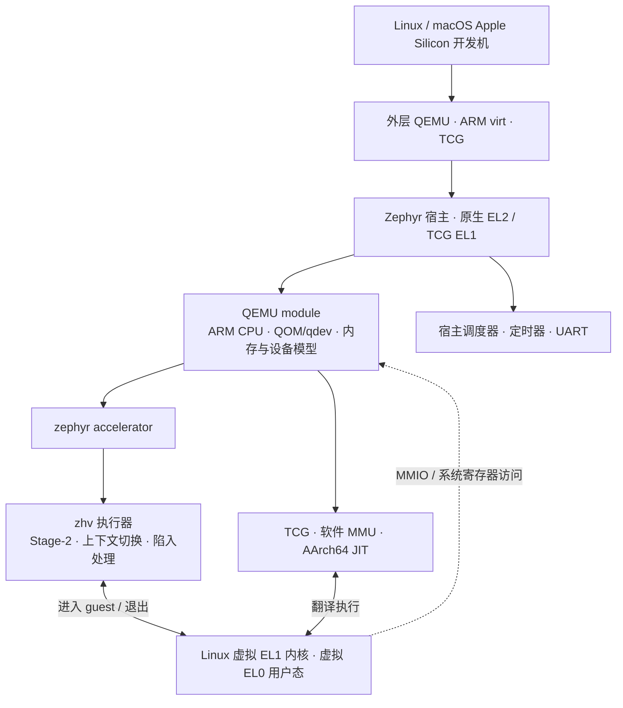

<div align="center">

# QEMU on Zephyr

### 用 QEMU 描述设备，用 Zephyr 承载运行，让 Linux 成为 guest。

[](https://github.com/processmission/qemu-on-zephyr/actions/workflows/build.yml)


把 QEMU 的 ARM machine、设备模型与 Linux loader 移植进 Zephyr，
通过 `zephyr` 原生 EL2 accelerator 或 TCG 软件翻译运行 ARM64 Linux。

[快速开始](#快速开始) · [架构](#架构) · [开发指南](CONTRIBUTING.md) · [English](README.md)

</div>

---

| 复用 QEMU | 扩展 Zephyr | 降低复现门槛 |
| :--- | :--- | :--- |
| QOM/qdev、内存系统、PL011、软件 GICv3、原有 ARM loader。 | EL2 宿主、Stage-2、guest 上下文、陷入处理和定时器。 | 固定上游版本、自动配置 west/Python/SDK、下载镜像、端到端验收。 |

## 快速开始

开发环境支持 **Linux x86_64/AArch64 和 macOS Apple Silicon**，需要
**Python 3.12 或更新版本**。Linux 参考环境为 Ubuntu 24.04；macOS 需要先安装
Xcode Command Line Tools 和 Homebrew，详见[环境要求](docs/setup.md#host-requirements)。
不需要 ARM 开发板或宿主 KVM；外层 QEMU 使用 TCG 提供 ARM 测试平台。

```sh
git clone https://github.com/processmission/qemu-on-zephyr.git
cd qemu-on-zephyr

# 安装系统依赖：Linux 使用系统包管理器，macOS 使用 Homebrew。
bash scripts/install-host-deps.sh

# 配置本地工具、源码、SDK 和 guest 镜像。
make setup

# 编译并进入 Linux shell。
make run
```

**Make 命令无需手动激活 venv，也无需每次设置 SDK 路径。**
退出外层 QEMU：按 **Ctrl-a，再按 x**。guest 内执行 `poweroff -f` 后，Zephyr
宿主仍会运行。

<details>
<summary><strong><code>make setup</code> 具体做什么？</strong></summary>

1. 创建 `.venv/`，安装固定版本的 west、CMake、Ninja。
2. 在仓库内创建 `.west/`，使用 `west update` 拉取四个固定依赖：QEMU、Zephyr、
   dtc/libfdt、zlib；不下载无关 HAL、固件或整个 Zephyr 模块集合。
3. 通过 `west packages` 安装本模块需要的 Python 构建与测试依赖。
4. 应用补丁和新增源码，生成可丢弃的构建源码树。
5. 复用已有 **Zephyr SDK 1.0.1**；缺少 SDK 时通过 `west sdk install` 安装
   **AArch64 GNU 工具链和 host tools**，其中包含 QEMU。
6. 下载 Linux Image、initramfs，并验证 SHA256。

环境选择记录在 `.tools/`。脚本不全局安装 Python 包、不自动调用 sudo；中断后
可以重跑。需要系统包时显式运行 `make host-deps`。

</details>

通过 `QEMU_ARGS` 指定 Zephyr 内部 QEMU 的机器、后端和 CPU 型号：

```sh
make run QEMU_ARGS='-M zephyr-virt -accel zephyr -cpu cortex-a57'
make run QEMU_ARGS='-M zephyr-virt,accel=tcg -cpu cortex-a72'
make check QEMU_ARGS='-accel tcg -cpu cortex-a53'
```

两种后端都支持 `cortex-a53`、`cortex-a57`、`cortex-a72`。默认机器是
`zephyr-virt`，使用 `zephyr` 后端和 Cortex-A53，提供一个 vCPU 和 256 MiB 内存。
参数会写入 Zephyr 构建配置，外层 QEMU 固定使用 `virt` 板卡。
`ACCEL`、`CPU` 为 `QEMU_ARGS` 中省略的选项提供默认值。
使用 `make run QEMU_ARGS='-help'` 查看选项，详见[机器、后端与 CPU 配置](docs/backends.md)。

已有 SDK 可显式指定：

```sh
ZEPHYR_SDK_INSTALL_DIR=/你的路径/zephyr-sdk-1.0.1 make setup
make doctor
```

首次安装完成后，后续构建无需网络。安装、原生 west 操作及故障处理见
[环境搭建说明](docs/setup.md)。

## 架构



这里有**两层 QEMU**。外层是开发机上的模拟器，加载 `zephyr.elf`；内层 QEMU
已编进这个 ELF，负责创建 guest machine、加载 Linux 和模拟设备。Linux 指令
可经 `zephyr` accelerator 进入 ARM 虚拟化执行路径，也可经内层 TCG 翻译执行。
TCG 配置使用 EL1 宿主并关闭外层虚拟化扩展；两种配置的外层仍使用 TCG。

QEMU 所需源码由 **Zephyr CMake/Ninja** 编译，未使用 QEMU 的 Meson 构建流程。
移植层维护明确的源码列表，同时复用 QEMU 的 QAPI/trace 生成器。QEMU 的
MemoryRegion 在原生模式下与 Stage-2 共享 guest RAM，在 TCG 模式下由软件 MMU
访问独立保留的 RAM；设备实现共用。

> 根仓库是 Zephyr 的树外 module，但 EL2 能力仍依赖本仓库提供的 Zephyr 内核
> 补丁。TCG 无需 EL2，当前统一构建流程仍使用本仓库准备的 Zephyr 源码树。

## 代码组织

| 路径 | 作用 |
| :--- | :--- |
| `west/west.yml` | 上游依赖的固定版本清单 |
| `upstream/` | 干净的 Git submodule，由 west 同步 |
| `src/qemu/` | accelerator、ARM 适配、GLib、串口、文件系统等新增代码 |
| `src/zephyr/` | EL2 执行器、公共接口和底层测试 |
| `patches/` | 按功能拆分的补丁，由 `series` 明确应用顺序 |
| `zephyr/` | module 元数据、Kconfig、CMake |
| `apps/`、`tests/` | 示例应用与回归测试 |
| `build/sources/` | 自动生成的源码树，不作为编辑入口 |

自己的修改都集中在主仓库。升级上游时，更新 submodule 和 west 清单，再调整补丁；
日常新增功能修改 `src/` 或应用代码即可。

## 常用命令

| 命令 | 用途 |
| :--- | :--- |
| `make setup` / `make doctor` | 配齐环境 / 检查环境 |
| `make update` | 用 west 同步固定版本依赖 |
| `make build` / `make run` | 编译 / 启动 Linux shell |
| `make check` | 验证 Linux、定时器、EL0/MMU、宿主调度及 guest 关机 |
| `make probe` / `make native-probe` | 设备模型 / 原生 accelerator 探针 |
| `make test-payload` / `make test-glib` | 只读文件系统 / GLib 差分测试 |
| `make test-arch` / `make test-tools` | 架构、FPU、执行器 / 环境工具测试 |
| `make clean` | 删除构建，保留 SDK、venv 和下载镜像 |

用 `JOBS=16` 调整并行度；用 `QEMU_SYSTEM_AARCH64` 覆盖默认的 SDK QEMU。
直接使用 west，可以先 `. .tools/env.sh`，再运行 `west list`、`west update`、
`west build`。详见 [开发指南](CONTRIBUTING.md)。

## 当前能力与验证

已支持 **单 VM、单 Cortex-A53/A57/A72 vCPU、256 MiB guest RAM、PL011、软件 GICv3、
Linux 6.4.16 initramfs shell**。

- 自动验收检查串口交互、定时器 IRQ 增长、EL0/MMU 执行，以及 guest 忙循环期间
  的宿主调度和 guest 关机后的宿主存活。
- 回归覆盖 196 项文件系统断言、184 行 GLib 差分输出、26 项架构/FPU/执行器测试。
- SDK 自带 QEMU 10.0.2 和系统 QEMU 10.2.2 均已运行过该配置。

物理板、多 VM、多核、块设备/网络后端、迁移、guest EL2/EL3、VM 重启与热插拔
尚不在已实现或已验证范围。这是实验性集成，尚不构成生产级隔离保证。

[补丁序列](docs/patches.md) · [架构细节](docs/architecture.md) · [验证记录](docs/validation.md) ·
[镜像来源](docs/guest-assets.md) · [许可证与来源说明](LICENSE.md)
