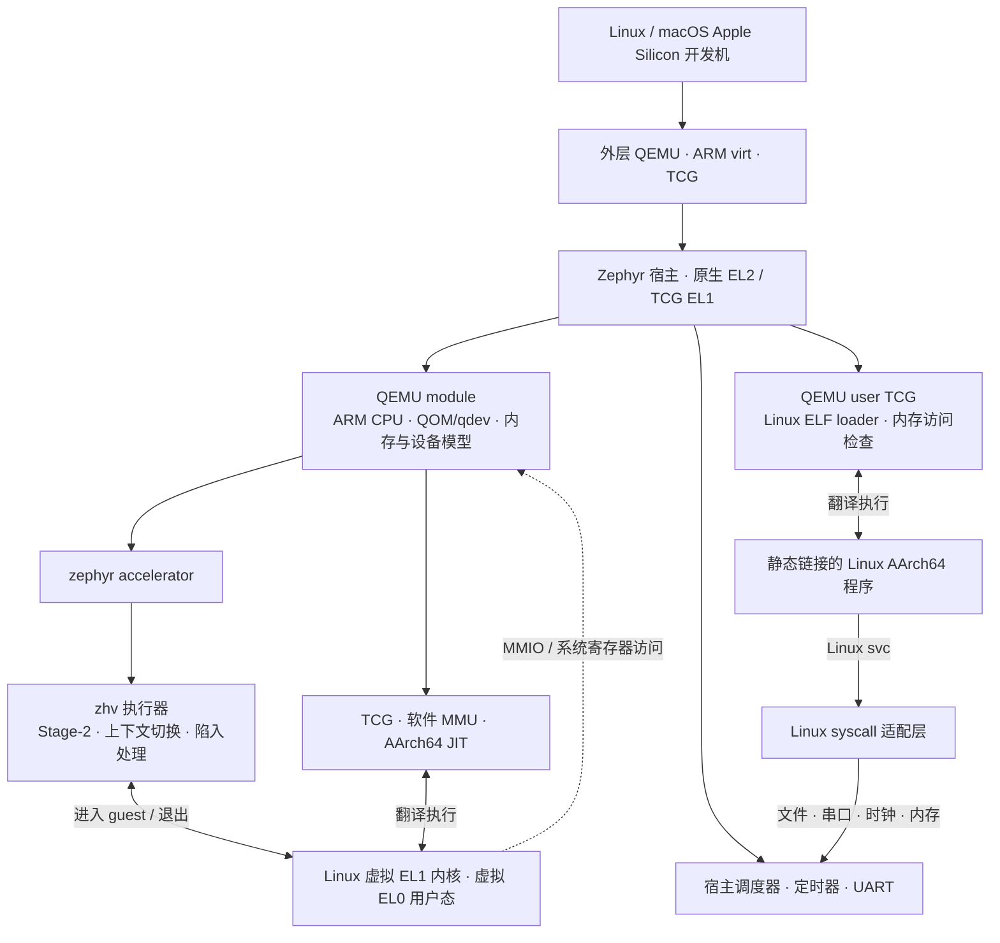

<div align="center">

# QEMU on Zephyr

### 在 Zephyr 上运行 QEMU system 模式和 Linux user 模式。

[](https://github.com/processmission/qemu-on-zephyr/actions/workflows/build.yml)


通过 QEMU system 模式运行 ARM64 Linux 和固件，通过 QEMU user 模式执行
静态链接的 Linux AArch64 程序。两种模式分别编译，都可以从 Zephyr shell
启动，并从挂载的文件系统加载镜像或程序。

[快速开始](#快速开始) · [运行模式](#运行模式) · [镜像文件](#镜像文件) · [Linux user 模式](#linux-user-模式) · [架构](#架构) · [English](README.md)

</div>

---

| 复用 QEMU | 扩展 Zephyr | 降低复现门槛 |
| :--- | :--- | :--- |
| ARM CPU、QOM/qdev、内存系统、PL011、软件 GICv3、Linux/ELF loader。 | system 模式使用 EL2 虚拟化或 TCG；user 模式使用 TCG，并将 Linux syscall 转换为 Zephyr 操作。 | 固定上游版本、配置 SDK/Python、准备 Ext2 镜像，在 Linux 和 macOS 上执行验收。 |

## 快速开始

开发环境支持 **Linux x86_64/AArch64 和 macOS Apple Silicon**，需要
**Python 3.12 或更新版本**。Linux 参考环境为 Ubuntu 24.04；macOS 需要先安装
Xcode Command Line Tools 和 Homebrew，详见[环境要求](docs/setup.md#host-requirements)。
不需要 ARM 开发板或宿主 KVM；外层 QEMU 使用 TCG 提供 ARM 测试平台。

```sh
git clone https://github.com/processmission/qemu-on-zephyr.git
cd qemu-on-zephyr

# 安装系统依赖：Linux 使用系统包管理器，macOS 使用 Homebrew。
bash scripts/install-host-deps.sh

# 配置本地工具、源码、SDK 和 guest 镜像。
make setup

# 编译并进入 Zephyr shell。
make run QEMU_SHELL=1
```

在 `zephyr>` 提示符下，从文件系统加载 Linux：

```text
fs ls /images
qemu-system-aarch64 -M zephyr-virt -accel zephyr -cpu cortex-a53 -kernel /images/Image -initrd /images/initramfs.cpio.gz
```

按 Ctrl-] 可以停止 guest 并返回 Zephyr。guest 结束后，使用
`kernel reboot cold` 重启 Zephyr，再启动另一个 guest。自定义镜像、ELF 固件和
原始固件的使用方法见 [shell 与文件系统说明](docs/shell.md)。

`make run` 默认自动启动 Linux。设置 `QEMU_SHELL=1` 后，Zephyr 等待手动输入命令。
Make 参数、文件准备和程序启动方法分别见下方的[运行模式](#运行模式)、
[镜像文件](#镜像文件)和 [Linux user 模式](#linux-user-模式)。

**Make 命令无需手动激活 venv，也无需每次设置 SDK 路径。**
退出外层 QEMU：按 **Ctrl-a，再按 x**。guest 内执行 `poweroff -f` 后，Zephyr
宿主仍会运行。

<details>
<summary><strong><code>make setup</code> 具体做什么？</strong></summary>

1. 创建 `.venv/`，安装固定版本的 west、CMake、Ninja。
2. 在仓库内创建 `.west/`，使用 `west update` 拉取四个固定依赖：QEMU、Zephyr、
   dtc/libfdt、zlib；不下载无关 HAL、固件或整个 Zephyr 模块集合。
3. 通过 `west packages` 安装本模块需要的 Python 构建与测试依赖。
4. 应用补丁和新增源码，生成可丢弃的构建源码树。
5. 复用已有 **Zephyr SDK 1.0.1**；缺少 SDK 时通过 `west sdk install` 安装
   **AArch64 GNU 工具链和 host tools**，其中包含 QEMU。
6. 下载 Linux Image、initramfs，并验证 SHA256。

环境选择记录在 `.tools/`。脚本不全局安装 Python 包、不自动调用 sudo；中断后
可以重新运行。需要系统包时显式运行 `make host-deps`。

</details>

通过 `QEMU_ARGS` 指定 Zephyr 内部 QEMU 的机器、后端和 CPU 型号：

```sh
make run QEMU_ARGS='-M zephyr-virt -accel zephyr -cpu cortex-a57'
make run QEMU_ARGS='-M zephyr-virt,accel=tcg -cpu cortex-a72'
make check QEMU_ARGS='-accel tcg -cpu cortex-a53'
```

两种后端都支持 `cortex-a53`、`cortex-a57`、`cortex-a72`。默认机器是
`zephyr-virt`，使用 `zephyr` 后端和 Cortex-A53，提供一个 vCPU 和 256 MiB 内存。
参数会写入 Zephyr 构建配置，外层 QEMU 固定使用 `virt` 板卡。
`ACCEL`、`CPU` 为 `QEMU_ARGS` 中省略的选项提供默认值。
使用 `make run QEMU_ARGS='-help'` 查看选项，详见[机器、后端与 CPU 配置](docs/backends.md)。

已有 SDK 可显式指定：

```sh
ZEPHYR_SDK_INSTALL_DIR=/你的路径/zephyr-sdk-1.0.1 make setup
make doctor
```

首次安装完成后，后续构建无需网络。安装、原生 west 操作及故障处理见
[环境搭建说明](docs/setup.md)。

## 运行模式

外层 QEMU 固定使用 `virt` 板卡和 TCG。以下 Make 参数配置 Zephyr 内部的 QEMU：

| 参数 | 含义 |
| :--- | :--- |
| `QEMU_MODE=system` | 默认模式，编译 `qemu-system-aarch64` shell 命令 |
| `QEMU_MODE=user` | 编译用于执行 Linux 程序的 `qemu-aarch64` shell 命令 |
| `QEMU_SHELL=0` | 默认自动启动，Zephyr 启动并挂载文件系统后执行配置的命令 |
| `QEMU_SHELL=1` | 进入 Zephyr shell，等待手动输入命令 |
| `QEMU_ARGS='…'` | system 支持 `-M`/`-machine`、`-accel`、`-cpu`；user 支持 `-cpu`、`-E`、`-strace`、程序路径和参数 |
| `ACCEL`、`CPU` | 为 system 中省略的选项提供默认值；`CPU` 也可选择 user 模式的 CPU 型号 |
| `GUEST_FILES=/absolute/path` | 用于创建镜像磁盘的开发机目录 |
| `GUEST_DISK=/absolute/path/disk.img` | 启动时挂载的现有磁盘；也用于指定 `make guest-disk` 的输出路径 |

system 与 user 使用不同的固件。原生 system 配置让 Zephyr 运行在 EL2，
通过 `zephyr` accelerator 使用 ARM 虚拟化接口；TCG system 配置和 user 配置
让 Zephyr 运行在 EL1。当前原生后端已在外层 QEMU 提供的 ARM 平台上运行验证，
物理开发板仍未验证。

system 自动启动时读取 `/images/Image` 和 `/images/initramfs.cpio.gz`。
需要使用其他路径时，通过 system shell 命令指定镜像。
user 自动启动时，需要在 `QEMU_ARGS` 中提供程序路径。

system 的后端在编译时选择，shell 中的 `-accel` 必须与固件一致。
原生后端的 `-cpu` 也必须与构建时配置的宿主 CPU 一致；TCG system 固件可以
在 shell 中选择 A53、A57 或 A72。user 模式固定使用 TCG，shell 中的 `-cpu`
必须与编译配置一致。`QEMU_MODE`、`QEMU_SHELL` 的不同取值使用独立构建目录。

## 镜像文件

`make run` 默认根据已经验证的 Linux 下载文件创建 `build/guest-disk.img`。
外层 QEMU 通过 VirtIO Block 提供磁盘，Zephyr 将 Ext2 文件系统只读挂载到
`/images`，其中包含 `Image` 和 `initramfs.cpio.gz`。`make host-deps` 会在
Linux 或 macOS 上安装 e2fsprogs，构建工具会查找其 `mke2fs`。

将自己的 Linux 镜像、固件或用户程序放入开发机目录，再创建并挂载磁盘：

```sh
make guest-disk GUEST_FILES=/absolute/path/to/images GUEST_DISK="$PWD/build/custom.img"
make run QEMU_SHELL=1 GUEST_DISK="$PWD/build/custom.img"
```

进入 Zephyr 后，使用 `fs ls /images` 查看文件。开发机上的
`/absolute/path/to/images/firmware.elf` 对应 Zephyr 中的 `/images/firmware.elf`。
`make run GUEST_FILES=…` 会根据该目录创建或更新默认磁盘。
`make run GUEST_DISK=…` 会挂载已经存在的磁盘；修改源文件后，使用
`make guest-disk` 重新生成这个磁盘。源目录可以包含普通文件和子目录，
磁盘输出文件需要放在 `GUEST_FILES` 目录之外，工具会拒绝符号链接。

现有磁盘需要在扇区零开始存放 Ext2 文件系统，使用 4096 字节块、128 字节 inode
和 `filetype` 特性。Zephyr 禁用自动格式化，写入 `/images` 会返回 `EROFS`。
加载器也可以读取应用挂载的其他文件系统，详见[文件系统说明](docs/shell.md#preparing-image-files)。

## System shell 命令

在开发机启动需要手动输入命令的 TCG system 固件：

```sh
make run QEMU_MODE=system QEMU_SHELL=1 QEMU_ARGS='-M zephyr-virt -accel tcg -cpu cortex-a53'
```

在 `zephyr>` 提示符下加载 Linux：

```text
qemu-system-aarch64 -help
qemu-system-aarch64 -M zephyr-virt -accel tcg -cpu cortex-a72 -kernel /images/Image -initrd /images/initramfs.cpio.gz -append "console=ttyAMA0 rdinit=/bin/sh nokaslr panic=-1"
```

| shell 选项 | 含义 |
| :--- | :--- |
| `-M`、`-machine` | 选择 `zephyr-virt`，支持 `type=` 和 `accel=` 属性 |
| `-accel`、`-cpu` | 按上述构建约束选择后端和 CPU |
| `-kernel PATH` | 加载 Linux AArch64 Image 或 AArch64 ELF 固件 |
| `-initrd PATH`、`-append STRING` | 指定 initramfs 和内核命令行；包含空格时使用引号 |
| `-bios PATH` | 将原始 EL1 固件加载到 `0x40000000` 并从该地址执行 |
| `-m 256M`、`-smp 1`、`-nographic` | 使用固定 guest 内存、一个 vCPU 和串口控制台 |
| `-help` | 查看用法；`-M help`、`-accel help`、`-cpu help` 列出支持的选项 |
| `-status` | 按需查看运行状态、guest 已完成执行的计数和宿主调度计数 |

镜像路径使用 Zephyr 文件系统的绝对路径。`-kernel` 与 `-bios` 只能选择一个；
`-initrd` 和 `-append` 需要与 `-kernel` 一起使用。挂载包含固件的自定义磁盘后，
可以选择以下一条命令启动对应文件：

```text
qemu-system-aarch64 -kernel /images/firmware.elf
qemu-system-aarch64 -bios /images/firmware.bin
```

每次启动固件前都需要处于一次新的 Zephyr 启动中。guest 运行在 EL1，RAM 起点为
`0x40000000`，PL011 位于 `0x09000000`，中断控制器是软件 GICv3。
原始固件需要按加载地址链接，ELF 的各个段和入口地址由 QEMU loader 处理。

### Guest 退出与再次启动

system 模式将 QEMU 编译进 Zephyr，并在一次 Zephyr 启动中初始化一个 VM。
`QEMU guest exited: 0` 表示 guest 执行循环正常结束，机器、CPU 和其他 QEMU
全局对象仍然存在。因此，再次输入启动命令时会显示
`QEMU already initialized; use kernel reboot cold before another guest`。

在 Zephyr shell 执行下面的重启命令，等待重新出现提示符后再执行启动命令：

```text
kernel reboot cold
qemu-system-aarch64 -kernel /images/Image -initrd /images/initramfs.cpio.gz
```

参数检查和文件不存在的错误允许立即重试。QEMU 初始化后发生的加载错误，
同样需要重启 Zephyr 后再运行。Linux 中执行 `poweroff -f`，或按 Ctrl-]，
都会返回 Zephyr shell。执行计数和宿主调度计数仅在主动输入
`qemu-system-aarch64 -status` 时输出。

## Linux user 模式

将静态链接的 Linux AArch64 可执行文件放入开发机目录，选择 user 固件：

```sh
make run QEMU_MODE=user QEMU_SHELL=1 GUEST_FILES=/absolute/path/to/programs
```

在 Zephyr 提示符下，从文件系统启动程序：

```text
fs ls /images
qemu-aarch64 -help
qemu-aarch64 -cpu cortex-a53 -E MESSAGE=hello /images/hello "an argument"
qemu-aarch64 -strace /images/hello
```

命令支持与固件一致的 `-cpu`、用于查看 syscall 的 `-strace`，以及最多八个
`-E NAME=VALUE` 环境变量设置。程序路径之后的参数交给程序处理，包含空格时
使用引号。默认工作目录是 `/images`。

需要自动启动时，通过 Make 提供程序路径和参数：

```sh
make run QEMU_MODE=user QEMU_ARGS='-cpu cortex-a53 -E MESSAGE=hello /images/hello "an argument"' GUEST_FILES=/absolute/path/to/programs
```

user 模式复用 QEMU 的 user TCG 和 Linux ELF loader。程序执行 Linux `svc`
指令时，适配层将系统调用参数、标志、结构和错误码转换为 Zephyr 操作：

- 文件和控制台操作包括 `read`/`write`、向量 I/O、`openat`、`close`、`lseek`、
  `fstat`、`newfstatat`、`getcwd` 和 `chdir`。
- 内存操作包括 `brk`、私有 `mmap`、`munmap` 和 `mprotect`；TCG 检查 guest
  内存访问，并在代码写入后使对应翻译结果失效。
- 时间和随机数据使用 Zephyr 时钟、调度器和 VirtIO RNG。外层宿主的
  `/dev/urandom` 为 `getrandom` 和 ELF `AT_RANDOM` 提供数据。
- 进程接口提供每次启动的进程编号、虚拟 root 身份、`set_tid_address`、资源限制
  查询、`uname`、`exit` 和 `exit_group`。

当前支持一次执行一个**静态链接、单线程的命令行程序**，默认地址空间为
64 MiB，`guest_stack_size` 默认为 1 MiB。程序退出时关闭文件描述符并返回 shell，
同一次 Zephyr 启动中可以连续运行其他程序。按 Ctrl-] 会终止当前程序并返回
状态 130；其他状态值表示 Linux
退出码，或 128 加上终止信号编号。

尚未支持的 syscall 返回 Linux `ENOSYS`。当前范围不包含 `fork`、`clone`、
`execve`、网络套接字、程序安装的信号处理函数和动态库运行环境。
`/images` 保持只读。完整接口与配置说明见[用户模式文档](docs/user-mode.md)。

## 运行验证

在开发机运行以下命令：

```sh
make check
make check QEMU_SHELL=1 QEMU_ARGS='-accel tcg -cpu cortex-a53'
make check-firmware
make check-firmware QEMU_ARGS='-accel tcg'
make check-user
make check-user QEMU_ARGS='-cpu cortex-a72'
```

`make check` 验证自动启动，`QEMU_SHELL=1` 验证手动启动。
`make check-firmware` 验证 ELF 和原始固件、加载错误、Ctrl-] 终止，以及重启
Zephyr 后再次启动。`make check-user` 自动选择 user 固件和手动启动配置，
验证参数、环境变量、文件 I/O、内存、错误访问、随机数据和连续启动。

## 架构



这里有**两层 QEMU**。外层是开发机上的模拟器，加载 `zephyr.elf`；内层 QEMU
已编译到这个 ELF 中，在 system 模式下创建 guest machine、加载 Linux 和模拟设备，
在 user 模式下加载 Linux ELF 程序并转换系统调用。system 模式的 Linux 指令
可经 `zephyr` accelerator 进入 ARM 虚拟化执行路径，也可经内层 TCG 翻译执行。
TCG 配置使用 EL1 宿主并关闭外层虚拟化扩展；外层统一使用 TCG。

QEMU 所需源码由 **Zephyr CMake/Ninja** 编译，未使用 QEMU 的 Meson 构建流程。
移植层维护明确的源码列表，同时复用 QEMU 的 QAPI/trace 生成器。system 的
MemoryRegion 在原生模式下与 Stage-2 共享 guest RAM，在 TCG 模式下由软件 MMU
访问独立保留的 RAM；设备实现共用。user 模式使用独立的进程地址空间和
syscall 适配层，源码由 `zephyr/user.cmake` 选择。

> 根仓库是 Zephyr 的树外 module，但 EL2 能力仍依赖本仓库提供的 Zephyr 内核
> 补丁。TCG 无需 EL2，当前统一构建流程仍使用本仓库准备的 Zephyr 源码树。

## 代码组织

| 路径 | 作用 |
| :--- | :--- |
| `west/west.yml` | 上游依赖的固定版本清单 |
| `upstream/` | 干净的 Git submodule，由 west 同步 |
| `src/qemu/` | accelerator、ARM 适配、GLib、串口、文件系统等新增代码 |
| `src/qemu/ports/zephyr/user*.c` | Linux ELF 加载、user TCG、进程内存和 syscall 转换 |
| `src/zephyr/` | EL2 执行器、公共接口和底层测试 |
| `patches/` | 按功能拆分的补丁，由 `series` 明确应用顺序 |
| `zephyr/` | module 元数据、Kconfig、CMake |
| `apps/`、`tests/` | QEMU shell 应用、固件、Linux 用户程序和回归测试 |
| `scripts/` | 开发环境、源码准备、Ext2 镜像、构建和启动配置 |
| `build/sources/` | 自动生成的源码树，不作为编辑入口 |

自己的修改都集中在主仓库。升级上游时，更新 submodule 和 west 清单，再调整补丁；
日常新增功能修改 `src/` 或应用代码即可。

## 常用命令

| 命令 | 用途 |
| :--- | :--- |
| `make setup` / `make doctor` | 配置环境 / 检查环境 |
| `make update` | 用 west 同步固定版本依赖 |
| `make build` / `make run` | 编译 / 自动启动 guest；`QEMU_SHELL=1` 等待手动命令 |
| `make check` | 验证 Linux、定时器、EL0/MMU、宿主调度及 guest 关机 |
| `make guest-disk` / `make check-firmware` | 创建 Ext2 镜像 / 验证 shell 固件加载 |
| `make check-user` | 验证 Linux AArch64 程序执行和系统调用转换 |
| `make probe` / `make native-probe` | 设备模型 / 原生 accelerator 探针 |
| `make test-payload` / `make test-glib` | 只读文件系统 / GLib 差分测试 |
| `make test-arch` / `make test-tools` | 架构、FPU、执行器 / 环境工具测试 |
| `make clean` | 删除构建，保留 SDK、venv 和下载镜像 |

用 `JOBS=16` 调整并行度；用 `QEMU_SYSTEM_AARCH64` 覆盖默认的 SDK QEMU。
直接使用 west，可以先 `. .tools/env.sh`，再运行 `west list`、`west update`、
`west build`。详见 [开发指南](CONTRIBUTING.md)。

## 当前能力与验证

system 支持 **单 VM、单 Cortex-A53/A57/A72 vCPU、256 MiB guest RAM、PL011、软件 GICv3、
Linux 6.4.16 initramfs shell**。

user 支持静态链接、单线程的 Linux AArch64 程序，使用 64 MiB 进程地址空间，
并将系统调用交给 Zephyr 处理。

- 两种 system 后端均在三种 CPU 上通过串口、定时器 IRQ、EL0/MMU、宿主调度
  和 guest 关机后的运行检查。
- user 模式在 A53、A57、A72 上通过验收；静态 glibc 程序也完成了文件读取、
  内存申请与释放、时钟查询、标准输出和连续启动。
- 自动与手动启动、文件系统固件加载、错误处理和终止后的 shell 恢复均已验证。
  执行计数和宿主调度计数通过 `-status` 按需查询。
- 回归覆盖 196 项文件系统断言、184 行 GLib 差分输出、26 项架构/FPU/执行器测试。
- SDK 自带 QEMU 10.0.2 和系统 QEMU 10.2.2 均已运行过该配置。

system 模式的物理开发板、多 VM、多核、内层 guest 块设备和网络后端、迁移、guest EL2/EL3、
同一次 Zephyr 运行中重新创建 VM，以及热插拔，
尚不在已实现或已验证范围。外层 VirtIO 磁盘用于向 Zephyr 提供镜像文件。
这是实验性集成，尚不构成生产级隔离保证。

[补丁序列](docs/patches.md) · [架构细节](docs/architecture.md) · [验证记录](docs/validation.md) ·
[镜像来源](docs/guest-assets.md) · [许可证与来源说明](LICENSE.md)
