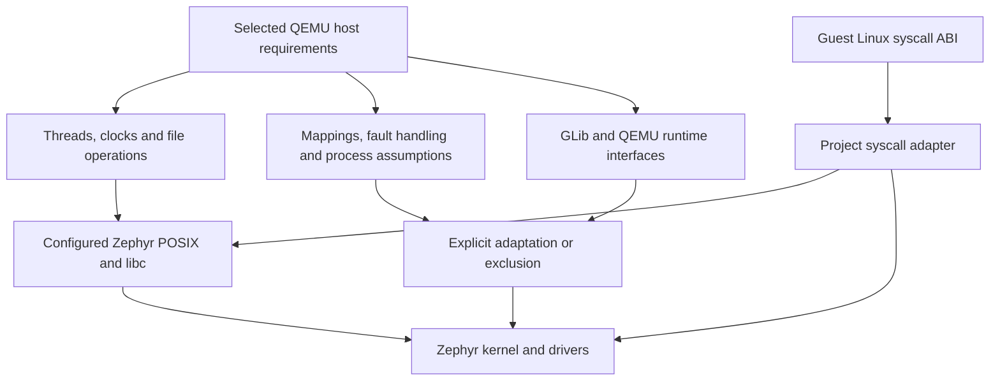
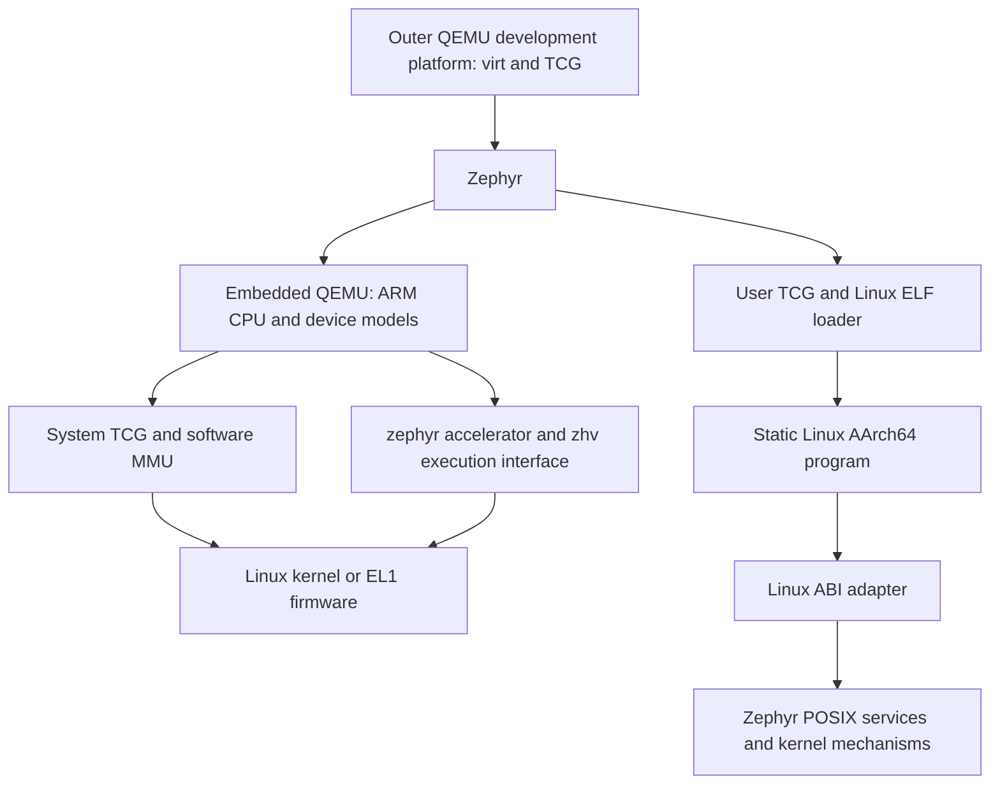

# QEMU on Zephyr: Extending the Boundaries of POSIX, Simulation and Virtualization

**Chinese title:** QEMU on Zephyr：拓展 Zephyr 的 POSIX、模拟与虚拟化能力边界

**Author:** Chao Liu

**Affiliation:** Process Mission

[LaTeX manuscript](paper.tex)

**Implementation baseline:** `2b1161806afe14fe57dec97234f37aac1ea84e5e`

**Manuscript date:** 9 October 2026

## Abstract

Porting QEMU to Zephyr subjects an embedded operating system's POSIX layer
to the requirements of a substantial emulator: threads, synchronization,
clocks, file descriptors, image loading, executable memory and runtime
lifecycle. This paper examines that porting process and uses the resulting
workloads to assess Zephyr's practical POSIX compatibility. The assessment
separates reusable POSIX services, semantic adaptations, direct kernel
mechanisms and deliberately excluded QEMU features. It identifies concrete
boundaries in regular-file positional I/O, file metadata, memory protection,
signals and process assumptions, while distinguishing those boundaries from
GLib dependencies and the Linux guest ABI. The implementation retains QEMU
device models and its Tiny Code Generator (TCG), adds an Arm EL2 execution
backend, and executes a
limited set of static Linux programs through a syscall adapter. Recorded
Linux, firmware and user-program executions demonstrate the selected host
interfaces working together on an emulated Arm platform. The resulting
architecture extends Zephyr toward simulation workloads and Type-1
hypervisor deployment on application-class SoCs. Physical-board performance,
standards-wide conformance and production isolation remain outside the
reported evidence.

**Keywords:** Zephyr, POSIX compatibility, QEMU porting, AArch64, TCG, Type-1 hypervisor

## 1. QEMU as a POSIX compatibility workload

A large emulator exercises an operating-system interface through sustained
interactions among subsystems. CPU realization allocates and initializes
objects, image loaders combine metadata queries with positioned reads,
translation engines manage executable code and invalidation, and execution
loops coordinate timers, wakeups and shutdown. These interactions expose
assumptions that an isolated successful API call can leave unexamined.

QEMU's Unix host interface makes extensive use of POSIX facilities, alongside
its own portability abstractions and library dependencies. Its architecture
also separates complete-machine execution from Linux user-program execution.
That division supplies several workloads for studying the host boundary.
[Bellard, 2005](https://www.usenix.org/conference/2005-usenix-annual-technical-conference/qemu-fast-and-portable-dynamic-translator).

Zephyr provides a configurable POSIX subset within an RTOS. Applications and
kernel code are normally linked into one artifact; the enabled profile and
libc determine the services available to that application. Portability
therefore depends on configuration, API semantics, resource limits and the
runtime model in which calls occur.
[Zephyr POSIX overview](https://docs.zephyrproject.org/latest/services/portability/posix/overview/index.html).

The project uses QEMU as an integration workload with three objectives:

1. Identify which host requirements can use enabled Zephyr POSIX services.
2. Make semantic adaptations and unsupported requirements explicit.
3. Demonstrate the retained emulator components through Linux, firmware and
   Linux ABI program execution.

The resulting assessment is specific to the pinned source, selected
configuration and exercised paths. No standards-wide API inventory or
conformance percentage is inferred from a successful guest boot. The central
result is a working host interface whose reusable services and remaining
portability boundaries can be inspected individually.

## 2. Assessment frame: three different interfaces

### 2.1 The host POSIX interface

This is the interface QEMU itself consumes inside Zephyr: pthread operations,
clocks, file operations and related host services. Its assessment concerns
the behavior that Zephyr and the selected libc supply to QEMU. The application
enables POSIX threads and files, compiler TLS and Picolibc, and configures
finite pools for threads, mutexes, condition variables and descriptors.
[Application configuration](../apps/qemu_linux/prj.conf);
[module configuration](../zephyr/Kconfig).

### 2.2 QEMU and library interfaces

The QEMU Object Model (QOM), MemoryRegion, the big QEMU lock (BQL),
read-copy-update (RCU), GLib containers and TCG are QEMU or library interfaces.
They need host facilities, but their presence is not a measure of POSIX
coverage. The port's GLib subset has separate differential tests.
Likewise, disabling a QEMU subsystem such as migration describes the selected
port surface; it does not by itself identify a missing Zephyr POSIX service.

### 2.3 The guest Linux ABI

In user mode, a guest program issues Linux AArch64 syscall numbers. A project
adapter interprets those requests and invokes available host operations.
Zephyr has its own build-generated kernel syscall identifiers and a POSIX
library interface. The Linux ABI adapter is an additional compatibility
layer, and its syscall tests evaluate that layer.
[Zephyr POSIX implementation](https://docs.zephyrproject.org/latest/services/portability/posix/implementation/index.html);
[Linux ABI adapter](../src/qemu/ports/zephyr/user-syscall.c).



*Figure 1. The assessment separates host POSIX behavior, QEMU/library
requirements and guest Linux ABI translation.*

For each requirement, the study records the pinned implementation, the
selected adaptation, the evidence that exercises it, and the limits of that
evidence. Source inspection establishes implementation details such as an
explicit `ENOSYS` return. Runtime tests establish behavior along their actual
paths. These forms of evidence are kept distinct throughout the assessment.

## 3. Porting method

### 3.1 Establish a reproducible build boundary

The build starts from pinned QEMU, Zephyr, dtc and zlib revisions. It exports
those sources into `build/sources/`, applies ordered patches, and overlays
new implementation files. Zephyr CMake selects the QEMU sources and invokes
the original QAPI, trace and instruction-decoder generators. The upstream
checkouts remain clean.
[Manifest](../west/west.yml); [module build](../zephyr/CMakeLists.txt).

The port defines a Zephyr host environment in QEMU's platform abstraction.
Header selection, page-size discovery and macro names require explicit
handling: Zephyr's numeric configuration macros and QEMU's macro conventions
must retain their respective meanings. Aligned allocations use the selected
libc with size rounding and overflow checks. These are compiler, build and
C-library adaptations adjacent to the POSIX interface.
[Host configuration](../src/qemu/ports/zephyr/config-host.h);
[host-header patch](../patches/qemu/0001-osdep-add-zephyr-host-definitions.patch);
[allocation patch](../patches/qemu/0002-util-allocate-aligned-memory-on-zephyr.patch).

### 3.2 Retain an executable QEMU component surface

The system source set retains ARM CPUs, QOM/qdev, MemoryRegion dispatch,
PL011, a software GICv3 and the ARM loaders. A device-model probe exercises
QOM construction and PL011 register accesses on Zephyr. This supplies a
runtime checkpoint for the object, allocation and device-dispatch layers
before interpreting the results of a complete guest workload.
[Probe application](../apps/qemu_probe/);
[machine implementation](../src/qemu/ports/zephyr/machine.c).

The selected GLib interface supplies data structures and utility operations
needed by that source set. Its differential test executes the local
implementation and the development host's GLib with matching inputs,
including allocation-overflow behavior. The result supports those exercised
library semantics. It supplies neither full GLib compatibility nor POSIX
conformance evidence.
[GLib implementation](../src/qemu/ports/zephyr/glib/);
[differential tests](../tests/glib/).

The [C-library inventory](posix-assessment.md#c-library-integration) separates
library adaptation from source reuse and build configuration:

| Component | System/user C units | Treatment |
| --- | --- | --- |
| GLib API subset | 1 / 1, plus shared bridges | Local API implementation; file, time and initialization bridges |
| libfdt | 8 / 0 | Unchanged upstream C/header sources; no library-specific POSIX bridge |
| zlib | 6 / 2 | Unchanged sources; `Z_SOLO` and QEMU's existing allocation callbacks |
| Picolibc | SDK runtime | Selected by Zephyr; outside QEMU-side source counts |

The counts describe compilation inputs. zlib's system profile includes
inflate and checksum sources; its user profile includes Adler-32 and CRC-32
sources. The project keeps no libfdt or zlib patch series. The inventory
records the fixed revisions, selected files and comparison hashes.

### 3.3 Give the embedded runtime an owner

The application creates one POSIX worker using `pthread_create()` and
explicit thread attributes. QEMU mutex and condition-variable wrappers call
Zephyr's pthread functions. The worker owns model operations, CPU execution,
timers and deferred reclamation. The port preserves BQL ownership across
execution transitions and reclaims deferred RCU callbacks at quiescent
points outside read-side sections.
[Application](../apps/qemu_linux/src/main.c);
[host runtime](../src/qemu/ports/zephyr/os.c).

This ownership policy is also a semantic precondition for several adapters.
Private file descriptors permit a seek/read/restore implementation of
positioned I/O. Single-owner initialization permits bounded handling of
one-time initialization and RCU readers. Those policies must be revisited
when adding QEMU threads or shared-descriptor concurrency; the current
implementation makes their scope explicit.

### 3.4 Connect image loading to real storage

Outer QEMU supplies VirtIO Block storage. Zephyr mounts Ext2 read-only at
`/images`, and the loader reaches it through the file adapter. Kernel,
initramfs and ELF data use real filesystem operations. GLib mapped-file
objects are represented by private file snapshots whose references and
lifetime are managed by the adapter.
[File adapter](../src/qemu/ports/zephyr/file.c);
[filesystem configuration](../apps/qemu_linux/shell.conf).

The applied Ext2 adaptation makes inode synchronization conditional on mount
writability. This is a filesystem integration requirement beneath POSIX:
loader close and synchronization paths must respect the mounted medium's
read-only filesystem requirement.
[Ext2 patch](../patches/zephyr/0007-fs-ext2-preserve-read-only-inode-synchronization.patch).

### 3.5 Add execution and an explicit command lifecycle

The system runtime creates the machine, selects its compiled accelerator,
loads the image and services execution returns. The user runtime uses a
separate source selection with upstream user TCG and Linux ELF loading.
Both are exposed through Zephyr shell commands that copy arguments before
waking the worker.
[System bootstrap](../src/qemu/ports/zephyr/bootstrap.c);
[user runtime](../src/qemu/ports/zephyr/user.c);
[user source selection](../zephyr/user.cmake).

The shell owns UART input and uses a bypass callback while a guest runs.
Ctrl-] requests termination, and completion restores the prompt. Automatic
startup calls the same handler through `shell_execute_cmd()`. A worker-local
exit target converts QEMU loader exits into command return status, giving
embedded execution an explicit lifecycle within the surrounding RTOS.
[Console adapter](../src/qemu/ports/zephyr/console-uart.c);
[Zephyr shell interface](https://docs.zephyrproject.org/latest/services/shell/index.html).

## 4. Zephyr POSIX compatibility assessment

### 4.1 Findings by host requirement

The [quantitative assessment](posix-assessment.md) preserves the complete
inventories and sources. The pinned Zephyr tables enumerate 393 unique
callable names: 289 unqualified `yes`, 53 qualified and 51 unmarked. A separate
inventory of 50 QEMU-required host POSIX interfaces contains 31 reusable
Zephyr POSIX APIs, 8 items that need Zephyr-side adaptation, and 11 with
limited or unavailable behavior. This group contains two incomplete
`stat`/`fstat` metadata results and nine process/signal interfaces unavailable
in the selected profile; the nine are not all required for the Linux boot.


These percentages describe the enumerated interfaces. Some unqualified
documentation entries have `ENOSYS` implementations, and some unmarked
entries have actual providers. Source checks and runtime observations remain
necessary for a maturity assessment. The
[assessment workflow](figures/posix-porting-flow.svg) records this distinction.

The following findings concern the pinned Zephyr revision and this port's
configuration. “Adapted” identifies behavior implemented by the port;
“kernel mechanism” identifies a direct Zephyr facility used at that boundary.

| QEMU host requirement | Pinned interface or configuration | Port treatment and evidence |
| --- | --- | --- |
| Worker creation and synchronization | pthreads enabled; finite thread, mutex and condition-variable pools | Real pthread calls support the owner and used locking paths; guest execution supplies integration evidence |
| Clock access and waiting | POSIX clock calls plus Zephyr sleep/timer facilities | Clock queries are reused; deadline conversion and wakeups are adapted; guest clock and scheduling checks exercise selected paths |
| Basic regular-file operations | POSIX filesystem APIs over Zephyr VFS | open/read/seek/status/close paths load real images and user ELF files |
| Positioned regular-file I/O | `pread`/`pwrite` exist; pinned descriptor dispatch restricts offset I/O to shared-memory descriptors | The port uses private-descriptor seek/I/O/restore operations |
| File permissions reported by `stat` | The generic filesystem path reports type and size without execute bits | Loader handling follows the metadata actually available, while retaining ELF and mapping validation |
| Executable mapping and protection | Pinned `mprotect()` returns `ENOSYS`; user configuration disables POSIX mapped files | Zephyr kernel memory APIs provide JIT aliases; QEMU page metadata and helpers enforce guest access rules |
| Process and signal expectations | Zephyr's linked application model; several process-signal APIs return `ENOSYS` | Worker-local exit handling and synthetic guest termination replace the required selected paths |
| General QEMU I/O and concurrency facilities | Capabilities also depend on the selected QEMU source surface | Migration, hotplug, general coroutine scheduling and multiple vCPUs are excluded from this port |

The table is a workload-specific assessment. It separates reusable host
interfaces from behavior that needs Zephyr-side adaptation or narrower scope.
A successful port with adapters demonstrates the combined system;
claims about unadapted Zephyr POSIX behavior must be supported separately.

### 4.2 Pthreads and time: a reusable foundation with bounded evidence

The worker setup uses pthread attributes, a supplied memory region for the
thread, `SCHED_RR` policy selection and `pthread_create()`. QEMU's mutex
operations delegate to `pthread_mutex_*`; condition wrappers delegate to
`pthread_cond_*`. Timed condition waits construct an absolute deadline from
`clock_gettime(CLOCK_REALTIME)` and normalize nanoseconds.

These bindings invoke the host APIs and check their return codes.
The execution record demonstrates creation of the owner, model locking and
progress of an independent Zephyr thread while a guest executes. It does
not exhaust pthread cancellation, priority interactions, multi-owner
contention or every timed-wait path. Source binding and observed behavior
are therefore reported at different levels of granularity.

Clock and scheduler integration also uses direct kernel services. Exit
requests originate from Zephyr timers; halted execution uses wait/kick
synchronization. These mechanisms allow the selected QEMU loop to cooperate
with Zephyr's scheduler. An observed wakeup or advancing timer establishes
progress in the tested run, with no worst-case latency guarantee implied.
[Zephyr scheduling](https://docs.zephyrproject.org/latest/kernel/services/scheduling/index.html).

### 4.3 Positioned I/O: a symbol with narrower descriptor semantics

At the pinned revision, Zephyr's `pread()` and `pwrite()` pass an explicit
offset into `zvfs_rw()`. The descriptor layer's `supports_pread_pwrite()`
accepts shared-memory descriptors. A positioned operation on a regular file
therefore reaches an `ENOTSUP` result. QEMU's ELF loading path requires
positioned regular-file reads, making descriptor semantics material to the
port even though the API symbols are present.
[POSIX device I/O](https://github.com/zephyrproject-rtos/zephyr/blob/ba25413e5b6b2661a71db24888f6b89274f1480d/subsys/portability/posix/options/device_io.c);
[descriptor dispatch](https://github.com/zephyrproject-rtos/zephyr/blob/ba25413e5b6b2661a71db24888f6b89274f1480d/lib/os/zvfs/zvfs_fdtable.c).

The project's adapter saves the current offset, seeks, performs I/O and
restores the offset. This implementation assumes that QEMU owns these
descriptors on one worker. ELF loading and private file-mapping checks exercise this
path. Concurrent positioned access through a shared open-file description
would require a stronger implementation and separate tests. The evaluation
therefore credits the port adapter for the supported behavior.

### 4.4 File metadata: loader policy depends on returned information

The pinned `stat()` path obtains a Zephyr filesystem entry and reports its
type and size. Its mode contains `S_IFREG` or `S_IFDIR`, without execution
permission bits. The selected Linux ELF loader cannot apply its conventional
execute-bit policy using that metadata. The Zephyr adaptation accepts an
explicitly requested regular executable and retains ELF architecture and
address-range validation.
[Zephyr file status](https://github.com/zephyrproject-rtos/zephyr/blob/ba25413e5b6b2661a71db24888f6b89274f1480d/subsys/portability/posix/options/fs.c);
[loader adaptation](../patches/qemu/0014-linux-user-support-zephyr-execution.patch).

This observation concerns the generic filesystem/POSIX boundary used by the
port. It makes no claim that the on-disk format lacks permission metadata.
The requirement is to carry the information and its semantics through the
interface that the application actually consumes.

### 4.5 Memory protection and fault delivery

The pinned `mprotect()` implementation returns `ENOSYS`. The selected user
configuration explicitly disables POSIX mapped files. Consequently, the
memory behavior demonstrated by this port is implemented through a defined
combination of Zephyr kernel mechanisms and QEMU metadata.
[Pinned mprotect implementation](https://github.com/zephyrproject-rtos/zephyr/blob/ba25413e5b6b2661a71db24888f6b89274f1480d/subsys/portability/posix/options/mprotect.c);
[user configuration](../apps/qemu_linux/user.conf).

For generated code, an aligned backing buffer receives distinct writable
and executable mappings using `k_mem_map_phys_bare()`. The TCG adapter uses
the upstream cache-synchronization machinery to publish code through these
aliases. The configured buffer size is 16 MiB.
[TCG adapter](../src/qemu/ports/zephyr/tcg.c).

For Linux user memory, the runtime supplies a bounded 64 MiB region and
implements mapping operations with QEMU page metadata. Generated user loads
and stores pass through checked helpers; the integration includes atomic
and bulk-memory paths such as DC ZVA. Writes to translated code invoke QEMU's
invalidation mechanism. Invalid accesses terminate the emulated process
with a signal-derived status.
[Memory adapter](../src/qemu/ports/zephyr/user-memory.c);
[TCG user-memory patch](../patches/qemu/0014-linux-user-support-zephyr-execution.patch).

The resulting fault tests validate this adapter. They do not establish native
POSIX `mprotect()` semantics on Zephyr. That distinction is essential when a
successful workload contains a substantial host adaptation layer.

### 4.6 Signals, identity and process lifetime

The pinned signal implementation provides signal-set operations while
several process-signal functions, including `sigaction()` and `kill()`, return
`ENOSYS`. Enabling signal-related configuration alone therefore cannot
establish the host-fault-delivery model expected by a Linux user emulator.
The port maps the selected no-mask-save jump paths to `setjmp`/`longjmp`,
and detects guest faults through its memory helpers.
[Pinned signal implementation](https://github.com/zephyrproject-rtos/zephyr/blob/ba25413e5b6b2661a71db24888f6b89274f1480d/subsys/portability/posix/options/signal.c);
[jump adaptation](../src/qemu/ports/zephyr/os-zephyr.h).

The guest Linux PID, UID and signal requirements are also distinct from host
pthreads and Zephyr task identity. The user adapter assigns a positive
process ID per launch and a virtual root identity. It reports unsupported
Linux calls as `ENOSYS`; it does not install guest signal handlers or create
guest threads. Zephyr separately offers pthread and socket interfaces, so
their omission from this guest ABI is a port-scope decision.

System execution retains its initialized machine and global QEMU state after
the loop returns. A new VM requires a Zephyr reboot. User execution closes
descriptors and resets mappings, CPU and translation state for successive
programs. These rules replace the process-lifetime assumptions of a
conventional standalone emulator with explicit embedded-runtime ownership.

### 4.7 What the assessment supports

Threads, selected synchronization paths, clocks and basic file operations
form a usable foundation for the retained QEMU workload. Positioned I/O,
metadata, memory protection, signals and process assumptions identify the
interfaces that need semantic qualification or adaptation in this build.
The port's finite resource settings and single-owner policy are part of that
result.

A broader maturity assessment would require a declared POSIX profile, a
complete requirement inventory, targeted semantic tests and concurrency
coverage. The current evidence supports workload compatibility for the
documented configuration and exposes concrete areas for improving API
qualification and implementation. It provides no numerical POSIX
completeness score or certification claim.

## 5. Capability outcomes: simulation and virtualization

### 5.1 QEMU machine and TCG execution

QEMU's TCG translates guest instructions into host code and reuses translation
blocks associated with CPU state. System emulation uses a software MMU and
routes MMIO through device models.
[QEMU Translator Internals](https://www.qemu.org/docs/master/devel/tcg.html).

The project brings that execution engine together with ARM CPU objects,
PL011, a software GICv3 and the original ARM Linux/ELF loaders. Its
`zephyr-virt` machine provides one vCPU and 256 MiB RAM at `0x40000000`, with
PL011 at `0x09000000`. System TCG runs on an EL1 Zephyr host. A one-millisecond
timer requests execution exits so the owner can service timers and console
work. This supplies a software simulation path within the RTOS.
[Machine](../src/qemu/ports/zephyr/machine.c);
[TCG source selection](../zephyr/tcg.cmake).

### 5.2 EL2 execution and the Type-1 direction

Arm virtualization provides EL2 controls for trapping and Stage-2 address
translation. These mechanisms let a hypervisor define a guest's resource
view and handle accesses that require emulation.
[Arm, 2019](https://developer.arm.com/-/media/Arm%20Developer%20Community/PDF/Learn%20the%20Architecture/Armv8-A%20virtualization.pdf?revision=a765a7df-1a00-434d-b241-357bfda2dd31).

The native profile places Zephyr at non-VHE EL2 and connects the QEMU
`zephyr` accelerator to a kernel executor named `zhv`. The executor handles
guest entry/exit, Stage-2 mappings, registers, TLS, SIMD/FP state and timers.
The QEMU ARM adapter dispatches MMIO, system-register and PSCI exits and uses
software GICv3 state for interrupt delivery. Native CPU realization checks
the relevant host MIDR fields against the selected model.
[Executor](../src/zephyr/arch/arm64/core/hypervisor/executor.c);
[transitions](../src/zephyr/arch/arm64/core/hypervisor/switch.S);
[ARM adapter](../src/qemu/target/arm/zephyr.c).

This architecture gives Zephyr the execution control and device-model layer
needed to pursue a Type-1 hypervisor role on application-class SoCs. Such a
deployment places Zephyr in control of the physical virtualization interface.
The present experiments use an outer QEMU `virt` platform with TCG, so the
native backend exercises virtualized Arm architectural mechanisms within
that development environment. A physical deployment additionally requires
board support, memory and interrupt configuration, and hardware validation.
[Outer runner](../scripts/project.py);
[QEMU virt platform](https://www.qemu.org/docs/master/system/arm/virt.html).



*Figure 2. Execution capabilities enabled by the host port. System and user
paths are separate firmware builds.*

### 5.3 Linux user execution as an additional workload

The user path reuses QEMU user TCG and its Linux ELF loader. At `svc`, it
reads the syscall number from `x8`, supplies arguments from `x0`–`x5` to the
adapter and writes the result to `x0`. Files, private memory mappings, clocks,
entropy and selected process metadata are supported. Upstream user-emulation
documentation supplies the general model; the Zephyr-specific syscall
surface is defined by this project's implementation.
[QEMU user emulation](https://www.qemu.org/docs/master/user/main.html).

The default program is a static Linux ABI ELF built with the installed SDK.
A larger regression program exercises file I/O, mappings and faults. These
programs extend the workload beyond a kernel boot, while retaining the
distinction between host POSIX compatibility and guest Linux ABI support.

## 6. Evaluation method and recorded results

### 6.1 Source and environment

The implementation inspected for this manuscript is identified in the
header. The evaluation combines source inspection with the project's
recorded executions and checked-in acceptance workloads. Run reports are
versioned in [validation.md](validation.md). Raw console logs are generated
locally and excluded from Git. The record establishes successful finite
executions; repetition counts for failure-rate or timing-distribution
estimates are not available.

| Input | Recorded configuration |
| --- | --- |
| QEMU source | `1df256f5968e9f7c3c4533a1383b071c044a36d6`, version 11.1.50 development tree |
| Zephyr source | `ba25413e5b6b2661a71db24888f6b89274f1480d`, version 4.4.99 development tree |
| Toolchain | Zephyr SDK 1.0.1, AArch64 GNU |
| Outer emulator | SDK QEMU 10.0.2; records also include system QEMU 10.2.2 |
| Recorded development environments | macOS Apple Silicon and Ubuntu 24.04 AArch64 container |
| System workload | Linux 6.4.16 Image with the pinned BusyBox initramfs; ELF and raw firmware |
| User workload | Default hello, Linux ABI regression program and a static glibc program |

The manifest also pins dtc and zlib, and the asset ledger records guest
image hashes. Default configured capacities include 512 MiB outer RAM,
256 MiB system guest RAM, a 64 MiB user address region, a 16 MiB TCG code
buffer, and a 32 MiB native or 96 MiB TCG/user C-library arena. These are
configuration values; peak memory consumption requires separate measurement.
[Manifest](../west/west.yml); [assets](guest-assets.md);
[base configuration](../apps/qemu_linux/prj.conf);
[TCG configuration](../apps/qemu_linux/tcg.conf).

### 6.2 Evidence and attribution

| Experiment | Observed behavior | Compatibility evidence and limit |
| --- | --- | --- |
| Linux on both system backends and A53/A57/A72 | Console I/O, timer IRQ growth, EL0/MMU samples, host progress and shutdown | Integrated host interface works for the recorded profiles; individual POSIX APIs are not exhaustively characterized |
| ELF/raw firmware on both backends | Segments, initialized data, BSS, EL1 entry, PSCI shutdown and reboot | Loader, file and execution paths operate together |
| User ABI regression on A53/A57/A72 | argv/env, files, errno, memory mappings, code modification, time and entropy | Tests the combined user runtime and adapters |
| User fault cases | Invalid addresses, read-only writes, DC ZVA protection, unmapped access and relaunch | Tests software guest-memory enforcement and synthetic termination |
| Default user Make workflow | Real hello ELF, arguments, environment, tracing and clean outer exit | Checks that the advertised executable is actually present and runnable |
| Static glibc program | Initialization, stdio file reads, allocation, clock queries and repeated output | Establishes one additional application workload, with its specific syscall usage |
| Filesystem and GLib component checks | File-operation cases and differential library behavior | Evidence is scoped to those adapters, not standards-wide POSIX coverage |

The Linux checker reads the architectural timer interrupt count, sleeps in
the guest and confirms that the count advances. It runs a busy loop for
approximately eight guest-uptime seconds and queries the restored Zephyr
shell after poweroff. Positive EL0 and MMU-on samples show that execution
reached those states. They are samples at execution returns, not instruction
totals or processor-utilization measurements.
[System acceptance](../apps/qemu_linux/check.py).

The independent observer sleeps for one second between updates. The checker
requires progress and a maximum recorded gap below its 4000 ms acceptance
threshold. This is a finite-run health criterion. Worst-case integration
timing would also require analysis of initialization, interrupt masking,
allocation, device operations and the outer emulator's scheduling.

User acceptance executes real AArch64 instructions and Linux syscall
numbers. It checks private file mappings, self-modifying code, memory
permissions and termination, then starts another program. The default hello
ELF also executed directly in Ubuntu AArch64. Component evidence includes
196 payload-filesystem checks, 184 matching GLib differential output lines
and the recorded architecture/FPU/executor cases. These counts describe
the existing checks; they are not coverage scores.
[User acceptance](../tests/user/check.py);
[default workflow](../tests/user/check_default.py);
[component evidence](validation.md).

### 6.3 File updates and descriptor lifetime

External files are assembled into a read-only Ext2 image using source-content
fingerprints and atomic replacement of the completed disk. Outer QEMU keeps
its attached disk for the session. Restarting Zephyr resets inner runtime
state, while the outer file attachment remains.
[Disk builder](../scripts/guest_disk.py).

An update experiment published two checked-in workloads under one path:
hello first, then the Linux ABI regression program. After the host binary
and disk were replaced, the existing session still executed hello, including
after a Zephyr reboot. A new outer QEMU process executed the ABI workload
and returned its deliberate success-test status of 7. This confirms the
documented activation boundary for that workflow. It evaluates the storage
and lifecycle integration, independently of a POSIX conformance claim.

## 7. Implications for POSIX maturity and deployment

The [direct native probe](experiments/posix-native/README.md) adds empirical
evidence for these boundaries. File reads, clock queries, a real pthread
worker and condition notification completed. Regular-file positional I/O
returned `ENOTSUP`; `mprotect` and the tested signal-control providers returned
`ENOSYS`. The disk's real inode mode was 0755, while `stat/fstat` reported zero
permission bits with the correct regular-file type and size. The probe's
explicit declarations for four omitted public-header prototypes are recorded
with its configuration and observations.

The port demonstrates that a selected Zephyr POSIX configuration can supply
substantial parts of the host environment required by QEMU. The assessment
identifies reusable APIs, those needing Zephyr-side adaptation, incomplete
file-metadata results, and unavailable process/signal functions.
Regular-file positioned I/O needs appropriate offset semantics; filesystem
metadata must expose the policy information consumers require; protection
and signal interfaces need explicit qualification; and application lifetime
must be reconciled with an embedded runtime.

Future compatibility evaluations should attribute each success to its actual
provider: Zephyr POSIX, the selected libc, a kernel API or a project adapter.
They should exercise the relevant error and concurrency semantics as well
as the normal path. A QEMU feature excluded by configuration should remain
separate from an unavailable POSIX function in the resulting assessment.

The current artifact restricts system execution to one VM and one vCPU per
Zephyr boot. User execution permits one static, single-threaded program at
a time. Migration, hotplug, guest EL2/EL3, general signal delivery, dynamic
linking and guest process creation are outside the implemented profile.
The input disk is a snapshot; updated files become active after regeneration
and an outer QEMU restart.

The Zephyr execution experiments use an emulated Arm platform. They provide
no physical-board throughput, interrupt-latency, energy or memory-bandwidth
measurements. The security record covers selected faults and mechanisms;
input parsing and model code still run within the Zephyr application
environment. A production isolation claim or a real-time bound requires a
separate assessment. Deployment on a high-performance SoC also requires
its BSP, memory layout, GIC, timer and exception-level configuration.

## 8. Artifact and reproduction

The artifact includes pinned upstream inputs, ordered source patches, new
host and executor code, sample programs and acceptance scripts. Supported
development hosts are Linux x86_64/AArch64 and macOS Apple Silicon, with
Python 3.12 or newer. The main paths can be reproduced after checking out
the implementation revision:

```sh
bash scripts/install-host-deps.sh
make setup
make doctor
make check QEMU_ARGS='-accel zephyr -cpu cortex-a53'
make check QEMU_SHELL=1 QEMU_ARGS='-accel tcg -cpu cortex-a53'
make check-firmware
make check-firmware QEMU_ARGS='-accel tcg'
make check-user
make probe test-payload test-glib test-tools
make test-arch
```

The documented A57 and A72 selections reproduce the additional CPU-model
coverage. Each run should record its repository revision, SDK and outer
QEMU versions, configuration and console transcript. The Python environment
includes dependencies from the pinned Zephyr requirements; it is not a
fully locked transitive environment.

The [English guidelines](guidelines.md) and
[Chinese guidelines](guidelines.zh-CN.md) specify installation, program
updates and restart procedures. The principal assessment sources are
[`os.c`](../src/qemu/ports/zephyr/os.c),
[`file.c`](../src/qemu/ports/zephyr/file.c),
[`os-zephyr.h`](../src/qemu/ports/zephyr/os-zephyr.h), the
[module source lists](../zephyr/CMakeLists.txt), and the pinned Zephyr
implementations linked in Section 4.

The [LaTeX manuscript](paper.tex) is a standalone document with an embedded
bibliography. With Tectonic available, generate the PDF from the repository
root:

```sh
mkdir -p build/paper
tectonic --outdir build/paper docs/paper.tex
```

## References

1. Fabrice Bellard. “QEMU, a Fast and Portable Dynamic Translator.”
   *FREENIX Track: 2005 USENIX Annual Technical Conference*, pp. 41–46.
   USENIX Association, 2005.
   [Publication record](https://www.usenix.org/conference/2005-usenix-annual-technical-conference/qemu-fast-and-portable-dynamic-translator).
2. QEMU Project. “Translator Internals.” *QEMU Documentation*, version 11.1.50.
   [Official manual](https://www.qemu.org/docs/master/devel/tcg.html).
3. QEMU Project. “QEMU User space emulator.” *QEMU Documentation*.
   [Official manual](https://www.qemu.org/docs/master/user/main.html).
4. QEMU Project. “‘virt’ generic virtual platform.” *QEMU Documentation*.
   [Official manual](https://www.qemu.org/docs/master/system/arm/virt.html).
5. Zephyr Project. “POSIX: Overview” and “Implementation Details.”
   [Overview](https://docs.zephyrproject.org/latest/services/portability/posix/overview/index.html),
   [implementation](https://docs.zephyrproject.org/latest/services/portability/posix/implementation/index.html).
6. Zephyr Project. POSIX device I/O, descriptor dispatch, filesystem, memory
   protection and signal implementations at commit
   `ba25413e5b6b2661a71db24888f6b89274f1480d`.
   [Pinned source tree](https://github.com/zephyrproject-rtos/zephyr/tree/ba25413e5b6b2661a71db24888f6b89274f1480d).
7. Zephyr Project. “Shell” and “Scheduling.”
   [Shell manual](https://docs.zephyrproject.org/latest/services/shell/index.html),
   [scheduling manual](https://docs.zephyrproject.org/latest/kernel/services/scheduling/index.html).
8. Arm Limited. *Armv8-A virtualization*. Document 102142, Issue 01, 2019.
   [Official document](https://developer.arm.com/-/media/Arm%20Developer%20Community/PDF/Learn%20the%20Architecture/Armv8-A%20virtualization.pdf?revision=a765a7df-1a00-434d-b241-357bfda2dd31).

Online references were consulted on 9 October 2026. Project-specific findings
refer to the implementation baseline and the cited validation record.

Figure preparation also uses Kassis, T., Agarwal, V., He, Y., Patel, D., and
Brueckner, A. M. (2026),
[Scientific Agent Skills: A Library of Procedural Knowledge for Research Agents](https://doi.org/10.48550/arXiv.2609.00065).
The [figure provenance](posix-assessment.md#reproduction-and-figure-provenance)
records plotting tools, data transformations and the Mermaid source.
