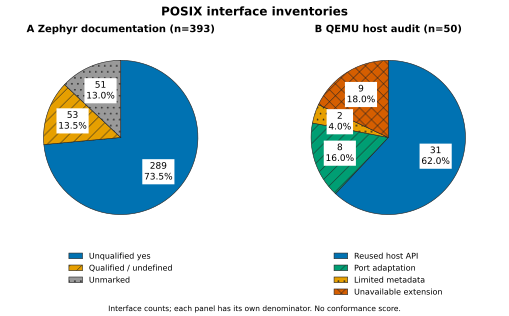

# POSIX interface assessment

This assessment records two aspects of the port: host compatibility and
additional port support, then QEMU implementation changes. It uses Zephyr revision
`ba25413e5b6b2661a71db24888f6b89274f1480d` and the QEMU port implementation
at `2b1161806afe14fe57dec97234f37aac1ea84e5e`. The inventories and native
experiment were prepared on 9 October 2026. The [paper](paper.tex) includes
the charts, support matrix and runtime observations.

## Interface inventories



| Inventory | Category | Interfaces | Share of its own inventory |
| --- | --- | ---: | ---: |
| Zephyr documentation | Unqualified `yes` | 289 | 73.5% |
| Zephyr documentation | Qualified or undefined behavior | 53 | 13.5% |
| Zephyr documentation | Unmarked | 51 | 13.0% |
| QEMU host audit | Reused host API | 31 | 62.0% |
| QEMU host audit | Port adaptation | 8 | 16.0% |
| QEMU host audit | Limited metadata | 2 | 4.0% |
| QEMU host audit | Unavailable extension | 9 | 18.0% |

Each slice counts interfaces with equal weight. The percentages describe the
two explicitly enumerated inventories. They do not measure standards-wide
conformance, performance, test coverage or the share of all QEMU features
implemented. Provider choice, configuration and required semantics determine
whether an interface is usable for a particular workload.

### Zephyr documentation denominator

The pinned [option-group document](https://github.com/zephyrproject-rtos/zephyr/blob/ba25413e5b6b2661a71db24888f6b89274f1480d/doc/services/portability/posix/option_groups/index.rst)
contains 47 API tables and 431 body rows. Docutils parses the reStructuredText
tables into document nodes. Extraction retains names ending in `()`, removes
that suffix, and deduplicates exact names across groups. Function-like macros
remain included. The result contains 419 callable rows and 393 unique names.

The 12 excluded rows name variables or constants: `optarg`, `opterr`, `optind`,
`optopt`, `stderr`, `stdin`, `stdout`, `environ`, `errno`,
`CLOCK_PROCESS_CPUTIME_ID`, `CLOCK_MONOTONIC` and `CLOCK_THREAD_CPUTIME_ID`.
ISO C groups discussed without enumerated APIs are outside the denominator.
This inventory therefore does not enumerate the full POSIX standard.

Any qualified occurrence takes precedence over an unqualified occurrence.
The qualified group contains 51 names marked with the undefined-behavior
obelus and two UTC-only names, `ctime_r` and `localtime_r`. An unmarked cell
means that the table supplies no support assertion. It does not establish
absence of an implementation.

The [full catalog](data/zephyr-posix-catalog.csv) preserves each unique name,
every original support cell, group membership and duplicate count. The
[manifest](data/posix-inventory.json) records exclusions, counts, source
hashes, package versions and percentage calculation.

### Reviewed QEMU host contracts

The [host audit](data/qemu-posix-audit.csv) is an explicit case inventory.
It contains 41 retained interfaces or adaptation contracts, plus nine
process/signal extension contracts. The latter identify capabilities beyond
the current execution profile; they are not all required for the present
Linux boot. The inventory excludes most general ISO C routines and does not
claim to exhaust all QEMU host dependencies. `exit` is retained because its
process-lifecycle meaning is a specific porting boundary.

| Treatment | Interfaces |
| --- | --- |
| Reused pthread APIs (21) | `pthread_attr_init`, `pthread_attr_destroy`, `pthread_attr_setstack`, `pthread_attr_setschedpolicy`, `pthread_attr_setschedparam`, `pthread_attr_setinheritsched`, `pthread_create`, `pthread_join`, `pthread_self`, `pthread_equal`, `pthread_mutex_init`, `pthread_mutex_destroy`, `pthread_mutex_lock`, `pthread_mutex_trylock`, `pthread_mutex_unlock`, `pthread_cond_init`, `pthread_cond_destroy`, `pthread_cond_signal`, `pthread_cond_broadcast`, `pthread_cond_wait`, `pthread_cond_timedwait` |
| Other reused APIs (10) | `clock_gettime`, `clock_getres`, `open`, `read`, `write`, `close`, `lseek`, `uname`, `flockfile`, `funlockfile` |
| Port adaptations (8) | `pread`, `pwrite`, `mmap`, `munmap`, `mprotect`, `sigsetjmp`, `siglongjmp`, `exit` |
| Limited metadata (2) | `stat`, `fstat` |
| Unavailable extensions (9) | `sigaction`, `kill`, `pause`, `sigpending`, `sigsuspend`, `sigwait`, `fork`, `execve`, `waitpid` |

The adaptation category describes the selected QEMU behavior. Private
descriptor seek/I/O/restore does not provide concurrent atomic positional
I/O. The input mount remains read-only. Guest mapping and protection use
QEMU metadata and checked helpers; generated-code mappings use kernel APIs.
The jump adapters handle calls with `savesigs == 0`. Worker-local exit
handling returns control to the surrounding runtime. These contracts do not
provide complete replacements for every use of the corresponding POSIX APIs.

Reused bindings also have finite evidence. The ledger records source use;
the native probe and existing guest acceptance exercise selected paths.
Neither establishes exhaustive synchronization, scheduling or filesystem
semantics for all 31 reused APIs.

## Source-confirmed gaps

Source inspection identified the following 39 catalog entries whose selected
Zephyr providers unconditionally report `ENOSYS`. Nine have an unqualified
`yes` cell; 30 have an undefined-behavior mark. These findings remain separate
from the documentation chart, because the remaining catalog has not received
an exhaustive source-and-runtime audit.

| Provider | Interfaces | Count |
| --- | --- | ---: |
| [Asynchronous I/O](https://github.com/zephyrproject-rtos/zephyr/blob/ba25413e5b6b2661a71db24888f6b89274f1480d/subsys/portability/posix/options/aio.c) | `aio_cancel`, `aio_error`, `aio_fsync`, `aio_read`, `aio_return`, `aio_suspend`, `aio_write`, `lio_listio` | 8 |
| [Memory protection](https://github.com/zephyrproject-rtos/zephyr/blob/ba25413e5b6b2661a71db24888f6b89274f1480d/subsys/portability/posix/options/mprotect.c) and [locking](https://github.com/zephyrproject-rtos/zephyr/blob/ba25413e5b6b2661a71db24888f6b89274f1480d/subsys/portability/posix/options/mlockall.c) | `mprotect`, `mlockall`, `munlockall` | 3 |
| [Process scheduling](https://github.com/zephyrproject-rtos/zephyr/blob/ba25413e5b6b2661a71db24888f6b89274f1480d/subsys/portability/posix/options/sched.c) | `sched_getparam`, `sched_getscheduler`, `sched_setparam`, `sched_setscheduler`, `sched_rr_get_interval` | 5 |
| [Signal control](https://github.com/zephyrproject-rtos/zephyr/blob/ba25413e5b6b2661a71db24888f6b89274f1480d/subsys/portability/posix/options/signal.c) | `kill`, `pause`, `sigaction`, `sigpending`, `sigsuspend`, `sigwait` | 6 |
| [Priority ceilings](https://github.com/zephyrproject-rtos/zephyr/blob/ba25413e5b6b2661a71db24888f6b89274f1480d/subsys/portability/posix/options/mutex.c) and [fork callbacks](https://github.com/zephyrproject-rtos/zephyr/blob/ba25413e5b6b2661a71db24888f6b89274f1480d/subsys/portability/posix/options/pthread.c) | `pthread_mutex_getprioceiling`, `pthread_mutex_setprioceiling`, `pthread_mutexattr_getprioceiling`, `pthread_mutexattr_setprioceiling`, `pthread_atfork` | 5 |
| [Groups](https://github.com/zephyrproject-rtos/zephyr/blob/ba25413e5b6b2661a71db24888f6b89274f1480d/subsys/portability/posix/options/grp.c) and [users](https://github.com/zephyrproject-rtos/zephyr/blob/ba25413e5b6b2661a71db24888f6b89274f1480d/subsys/portability/posix/options/pwd.c) | `getgrnam_r`, `getgrgid_r`, `getpwnam_r`, `getpwuid_r` | 4 |
| [STREAMS](https://github.com/zephyrproject-rtos/zephyr/blob/ba25413e5b6b2661a71db24888f6b89274f1480d/subsys/portability/posix/options/stropts.c) | `putmsg`, `putpmsg`, `fdetach`, `fattach`, `getmsg`, `getpmsg`, `isastream` | 7 |
| [Network status](https://github.com/zephyrproject-rtos/zephyr/blob/ba25413e5b6b2661a71db24888f6b89274f1480d/subsys/portability/posix/options/net.c) | `sockatmark` | 1 |

Further qualifications include shared-memory-only positional descriptor I/O,
limited `stat` metadata, a constant `getpid`, conditionally unsupported memory
locking, a no-op `msync`, and network-database functions with empty results.
`fcntl`, `lseek` and `times` demonstrate the converse documentation issue:
their table cells are blank while provider implementations exist. Provider
selection also depends on `CONFIG_TC_PROVIDES_*`, so a finding about Zephyr's
own provider cannot be applied automatically to every libc configuration.

## Direct provider observations

The [native probe](experiments/posix-native/README.md) executes actual Zephyr
and Picolibc calls with the QEMU port disabled. It uses the prepared Zephyr
tree, Cortex-A53 EL2, SDK 1.0.1, outer QEMU 10.0.2 and a real read-only Ext2
image. The public headers in the probe configuration omit declarations for
`pread`, `pwrite`, `mprotect` and `pause`; explicit declarations matching the
provider definitions are recorded in the probe source.

| Boundary | Actual observation |
| --- | --- |
| File input | `open`, `read`, `lseek` and `close` completed; read bytes matched ELF magic |
| Metadata | `stat/fstat` returned regular-file type and size 2496, with zero permission bits; disk inode mode was 0755 |
| Positioned I/O | `pread/pwrite` returned `ENOTSUP` on the regular read-only descriptor |
| Memory and signal control | `mprotect`, `sigaction`, `kill` with signal zero, `pause` and `sigwait` returned `ENOSYS` |
| Threads and conditions | Real worker creation/join and condition notification completed; timeout returned `ETIMEDOUT` directly |
| Clock query | Realtime and monotonic calls completed; realtime resolution was 10 ms at a 100 Hz tick configuration |
| Process boundary | `pthread_atfork` returned `ENOSYS` directly; `getpid` returned 42 |

The target reported `ENOSYS=88`, `ENOTSUP=134` and `ETIMEDOUT=116`. Pthread
errors use the function return value; the probe records errno separately.
The observations establish the stated cases. Writable mounts, exhaustive
thread semantics, process isolation and real-time bounds were not measured.

## C-library integration

The [dependency inventory](data/c-dependencies.json) records compilation
inputs for QEMU inside Zephyr. It excludes development-host tools and the
host GLib used by differential tests. Source-file counts describe the chosen
build profiles and do not measure POSIX API coverage.

| Component | System C units | User C units | Source treatment | Integration |
| --- | ---: | ---: | --- | --- |
| GLib API subset | 1 | 1 | Local API implementation | Core containers, strings, allocation and utilities; shared `os.c` and `file.c` provide additional time, initialization and file interfaces |
| libfdt from dtc | 8 | 0 | C/header files match upstream; zero dependency patches | DTB operations on memory buffers with existing C memory/string services |
| zlib | 6 | 2 | C/header files match upstream; zero dependency patches | `Z_SOLO`; system inflate/checksum sources and user checksum sources; upstream QEMU allocation callbacks |
| Picolibc | SDK | SDK | Toolchain runtime selected by Zephyr | C runtime outside the QEMU-side source count; no project Picolibc patch series |

The GLib core count excludes the shared port bridges. Their contents also
serve QEMU runtime interfaces, so counting all bridge lines as GLib changes
would duplicate those roles. The project implements selected GLib APIs;
the recorded differential tests cover that subset.

libfdt uses revision `b6910bec11614980a21e46fbccc35934b671bd81`.
The system build selects `fdt.c`, `fdt_ro.c`, `fdt_rw.c`, `fdt_sw.c`,
`fdt_wip.c`, `fdt_strerror.c`, `fdt_empty_tree.c` and `fdt_addresses.c`.
The port adds no libfdt-specific file, thread or process wrappers.

zlib uses revision `51b7f2abdade71cd9bb0e7a373ef2610ec6f9daf`.
System mode selects `adler32.c`, `crc32.c`, `inflate.c`, `inftrees.c`,
`inffast.c` and `zutil.c`; user mode selects `adler32.c` and `crc32.c`.
`Z_SOLO` excludes the gzip file-I/O APIs and default allocators. Upstream
QEMU's `hw/core/loader.c` already supplies `zalloc` and `zfree` through
`g_malloc` and `g_free`. The port reuses these callbacks with its GLib subset.
This records configuration and allocator integration with unchanged zlib
sources.

TCG profiles compile QEMU's in-tree SoftFloat and AES/SM4 helpers.
Pixman, libslirp, GnuTLS/nettle and SDL are examples of optional libraries
outside this firmware profile. No library-portability result is recorded
for those excluded features. The SDK C runtime and Zephyr's POSIX providers
remain separate from the external library adaptation record.

The collector reads both real compilation databases, verifies the selected
mode and Picolibc flags, and checks `Z_SOLO` on each zlib compile command.
It compares prepared libfdt/zlib C and header files with clean, fixed upstream
trees. The output preserves source lists, revisions and hashes. After the
system and user builds exist, run it with the figure environment described
below. The Make commands prepare the two default profiles:

```sh
make build QEMU_MODE=system QEMU_SHELL=0 QEMU_ARGS='-accel zephyr -cpu cortex-a53'
make build QEMU_MODE=user QEMU_SHELL=1 QEMU_ARGS='-cpu cortex-a53'
build/figure-env/bin/python scripts/dependency_inventory.py \
  --system-build build/linux \
  --user-build build/user-shell-tcg-cortex-a53
```

These default paths correspond to the native A53 system build and manual A53
user build. Other build directories can be selected with the same options.
The build configuration and source hashes identify the recorded profiles.

## Assessment workflow



The editable [Mermaid source](figures/posix-porting-flow.mmd) and the inline
LaTeX rendering retain the same eight nodes and seven edges. SVG and PNG
exports are provided for reuse in documentation and presentation materials.

The host path records native POSIX behavior, project adapters, and support
from libraries, build tools, storage drivers, and the Zephyr kernel. The QEMU
path records patches, new modules, changed execution paths, and build
exclusions. The axes identify cause and implementation. A single change can
appear on both axes without representing two independent contributions.

## QEMU implementation changes

The [patch ledger](data/qemu-patches.csv) records the 14 patches in
[patches/qemu/series](../patches/qemu/series). They affect 34 existing files,
with 348 inserted lines and 87 deleted lines. Counts come from
`git apply --numstat` for each patch and include physical diff lines.
New files under `src/qemu/` and Zephyr kernel extensions are outside these
totals. The Cortex-A72 move contributes 62 additions and 62 deletions while
retaining its register definitions.

| Main purpose | Patches | Added lines | Deleted lines | QEMU changes |
| --- | --- | ---: | ---: | --- |
| Host interface | 0001–0005 | 68 | 8 | Headers, macro handling, allocation, paths, optional timestamps and deterministic random mode |
| CPU and runstate | 0006, 0010 | 66 | 2 | Accelerator hooks, non-signal wakeup, shutdown/reset and omitted GDB or migration hooks |
| Device, loader and RAM profile | 0007–0009 | 47 | 1 | Migration registration, firmware services and memory-backend assumptions |
| TCG code allocation | 0011 | 14 | 1 | JIT allocation through writable/executable aliases |
| CPU models | 0012–0013 | 67 | 62 | GICv3-only initialization and shared Cortex-A72 registration |
| Linux user execution | 0014 | 86 | 13 | Checked memory accesses, invalidation, ELF policy, identity and omitted Linux host services |

New QEMU modules supply `zephyr-virt`, the `zephyr` accelerator, the ARM
adapter, TCG owner-thread integration, command startup, and the user runtime.
The user build retains TCG and ELF parsing with project syscall, memory and
lifetime policies. The GLib subset supplies host dependency support.
Zephyr EL2 code supplies the kernel executor used by the QEMU accelerator.

Host gaps and QEMU mechanisms have distinct evidence. For example, native
`mprotect` returns `ENOSYS`; the QEMU patch redirects user memory accesses
through checked helpers. POSIX API behavior belongs to the host assessment.
The emitter, helper and invalidation changes belong to the QEMU change record.

## Reproduction and figure provenance

The figure environment was exercised with Python 3.12. To reproduce from
the repository root:

```sh
python3.12 -m venv build/figure-env
build/figure-env/bin/python -m pip install -r docs/requirements-figures.txt
build/figure-env/bin/python scripts/posix_figures.py
```

The generator checks the Zephyr revision, validates the host ledger and
requires inspected source files to match their recorded baseline. A changed
provider requires a ledger review before regeneration. It preserves source
hashes and uses Docutils for tables, pandas for the audit
CSV and Matplotlib for the plots. Percentages use `100 * count / panel total`
rounded to one decimal place. No values are imputed or weighted, and no
confidence interval is attached to these finite inventory counts. The
180 by 112 mm figure exports include SVG text and 300 DPI PNG.
The SVG passes through lxml for XML whitespace normalization; geometry and
label text are retained.

The flowchart was rendered with Mermaid CLI 12.0.0 and the versioned
[rendering configuration](figures/mermaid-config.json):

```sh
mmdc -c docs/figures/mermaid-config.json -i docs/figures/posix-porting-flow.mmd -o docs/figures/posix-porting-flow.svg --size 2200
mmdc -c docs/figures/mermaid-config.json -i docs/figures/posix-porting-flow.mmd -o docs/figures/posix-porting-flow.png --size 2200
```

Figure design follows [Scientific Visualization](https://github.com/K-Dense-AI/scientific-agent-skills/tree/main/skills/scientific-visualization)
and [Mermaid Publishing](https://github.com/mermaid2img/mermaid-skills/tree/main/skills/mermaid-publishing).
Color is accompanied by labels, counts and hatch patterns in the standalone
plots. The inline LaTeX charts include count-labelled legends. The paper
cites Kassis et al., [Scientific Agent Skills](https://doi.org/10.48550/arXiv.2609.00065),
for the materially used figure workflow. No journal-specific acceptance or
accessibility certification is claimed.
